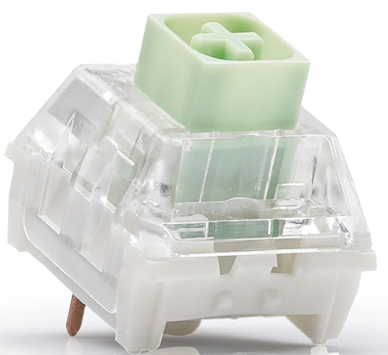

# Films

- [Films](#films)
  - [Materials](#materials)
  - [Switches that Films Don’t Work Good in](#switches-that-films-dont-work-good-in)
    - [Winglatch Housings](#winglatch-housings)
    - [Misc. Cases](#misc-cases)

Yeah man, they’re all good. There aren’t really good films or bad films, as they’ll all do the same job of making a top housing fit onto a bottom housing tighter. Just make sure you put them in the correct orientation.

Be sure to understand the material that the films you choose are made out of, and how your switches may react to them.
If you feel your switch develop an unexpected tactile bump, this may be the stem hitting against a part of the film poking into the housing well. Disassemble and replace film if/when this happens.

## Materials

- Soft
  - Foam (MDI, Deskeys)
    - Soft and very compressible. Generally will fit most switches, even in cases where they genuinely are too tight for most films. Fairly annoying to put on, due to the film bending so easily.
    - Generally 0.3mm thick - this is a normal thickness, and will compress down.
- Medium
  - HTV
    - More papery than polycarbonate, more flexible, but not really compressible like MDI foam/Deskeys film material/Silicone.
    - Around 0.15mm thick.
- Hard
  - Polycarbonate
    - These films are made of hard polycarbonate. They will not compress.
    - 0.125mm - 0.15mm thick. Buy 0.125mm thick if your housings feel like they don’t suffer from too much wobble, or 0.15mm thick if you’re sure that there’s a bit of housing wobble. Kebo makes films up to 0.2mm thick if your housing wobble is excessive.
  - PLA
    - Jinra makes 0.22mm films.
  
## Switches that Films Don’t Work Good in

### Winglatch Housings

| ❌ Winglatch top housing (Kailh Box Jade)                                                          | ✅ 4-pin ("Cherry-style") top housing (Gateron Brown)                                                                 |
| ------------------------------------------------------------------------------------------------- | -------------------------------------------------------------------------------------------------------------------- |
|                                                       |                                                                        |
| “Winglatch” housing (via kbdfans). The top housing is secured two large "wings", one on each side | “Cherry style”/”4 pin” top housing. Note the two "pins"/legs of each side the top housing, securing it to the bottom |

Winglatch housings are generally “tight enough” (reduced wobble in W-E direction) that films are not needed to prevent housing wobble, and cause difficulty in re-assembling the switch. These generally tend to get produced by Kailh for all their switches that aren’t Cream variants (Launch Creams, Blueberries, Cream Tactiles, etc.) non-Boba Outemu switches, most KTT stuff (and consequently most Akko CS stuff), but you should know these when you see these.

### Misc. Cases

These following switches are known to have fairly tight housings, and will not react well to films of medium or hard material (soft films may compress down enough that they still may be able to close together).

- Outemu x Gazzew “Boba” variants (this includes those with PC/clear tops)
- Kailh x Novelkeys Cream variants
- “Panda” housings
  - [The proliferation of housings made with the Panda name](https://www.theremingoat.com/blog/the-pandaverse) has kinda diluted the meaning, but thanks to the fact that most of these variants (Purple Pandas, Frost Pandas, Ethereal Pandas, Glorious Pandas) are produced by Tecsee, you can safely assume that the molds provide similarly tight tolerances. Pandas are known to have tight housings.
