# Keycaps

- [Keycaps](#keycaps)
  - [Comparing ABS versus PBT](#comparing-abs-versus-pbt)
  - [Switch orientation on PCB and keycap interference](#switch-orientation-on-pcb-and-keycap-interference)
  - [On Clones](#on-clones)
    - [Artisans](#artisans)
  - [On Kitting, or, How To Read A Kitting Diagram](#on-kitting-or-how-to-read-a-kitting-diagram)
    - [Extensions To Look For](#extensions-to-look-for)
    - [Example: A Well Kitted Keyset](#example-a-well-kitted-keyset)
  - [How To Find A Bad Keycap Set](#how-to-find-a-bad-keycap-set)
    - [Reading Reviews](#reading-reviews)
    - [Poor Legends Quality](#poor-legends-quality)
      - [Poor Printing](#poor-printing)
      - [Poor alignment](#poor-alignment)
      - [Mold quality](#mold-quality)
    - [Poor kitting/compatability](#poor-kittingcompatability)
    - [Warped Bars](#warped-bars)
    - [Stem Twist](#stem-twist)
    - [Reverse Dye Sublimation](#reverse-dye-sublimation)
      - [Reverse Dye-Sub Shrink](#reverse-dye-sub-shrink)
      - [Reverse Dye Sublimation Fade](#reverse-dye-sublimation-fade)
    - [Geekark Stems](#geekark-stems)
    - [Thickness](#thickness)
  - [Why expensive?](#why-expensive)
  - [Who's Who](#whos-who)
    - [GMK](#gmk)
    - [Signature Plastics (SP)](#signature-plastics-sp)
    - [JTK (JT Keycaps)](#jtk-jt-keycaps)
    - [DMK (Domikey)](#dmk-domikey)
      - [Cherry profile](#cherry-profile)
      - [SA profile](#sa-profile)
    - [EnjoyPBT (ePBT)](#enjoypbt-epbt)
    - [NicePBT/CannonCaps (CannonKeys Dye-sub)](#nicepbtcannoncaps-cannonkeys-dye-sub)
    - [Shenpo/Godwife/Goddess Dye Sublimation](#shenpogodwifegoddess-dye-sublimation)
    - [XMI/21KB](#xmi21kb)
    - [PBTFans](#pbtfans)
    - [Milkyway/MW](#milkywaymw)
    - [Keyreative](#keyreative)
    - [Infinikey (IFK)](#infinikey-ifk)
    - [Keykobo](#keykobo)
    - [Hammerworks/CRP](#hammerworkscrp)
    - [Drop](#drop)
    - [MT3](#mt3)
      - [DCX](#dcx)
      - [DCD](#dcd)
  - [Aifei (爱菲)](#aifei-爱菲)

## Comparing ABS versus PBT

* Doubleshot ABS
  * Good
    * Capable of more vivid colors
    * Brighter sound signature (if that's your sort of thing)
    * When the molds are good, they remain good for a fairly long time.
  * Bad
    * Shines faster
    * Yellows when exposed to UV light over time
    * Brighter sound signature (if that's your sort of thing)
    * Every key requires a legend mold to be made for it
    * If the molds are bad, they remain bad until remade.
      * "Shif t" legend on some China doubleshot
      * sinking ">." legend on Domikey SA
      * key alignment, consistent letter thickness
* UV-print ABS
  * Good
    * Very cheap to make!
  * Bad
    * Rubs off eventually (although some prints are more robust than you expect)
* Dye-sublimated PBT
  * Good
    * Does not yellow like ABS when exposed to UV light over time
    * PBT resists physical wear much more than ABS does, increasing the time it takes for a keyset to shine
      * This is somewhat dependent on the amount of texture the molds have; molds that create very smooth caps can shine faster than you would expect.
    * Lets you hit nice middle ground of being able to make interesting looking keyset for not very much money (although more expensive than the cheapest doubleshot OEM caps you may have seen before)
    * Marginally lower, more muted sound signature (if you're into that sort of thing)
  * Bad
    * Warps much more than ABS does on cooling, especially on longer keys
      * Most people who have complained about their GMK bars warping have never seen what PBT does when it hasn't been QC'ed properly before shipment
    * Consistent legend alignment is difficult
    * Bad prints can appear to be fuzzy on the cap
    * Colors tend to be more muted than ABS
    * Regular dye-sublimation limits you to printing dark legends onto light keycaps
    * Reverse/five-side sublimation to get a light legend appear on a darker keycap (by printing everywhere across the cap besides the legend) has a host of production issues, such as
      * Color/print on side walls
      * Increase difficulty in legend alignment
      * Possibility of print peeling if not applied hot enough (most famously on KAT Space Cadet)
      * Keycap wall shrink (if print is applied too hot for too long)
      * Softening of the cap (seen on early Milkyway)
* Doubleshot PBT
  * Good
    * All the nice parts about PBT being robust to wear and none of the problems about reverse dyesub
  * Bad
    * Same deal with molds as ABS - if they're bad now, they'll be bad until they're remade
    * Sometimes adulterated with ABS to inject easier - this leads to caps that shine SIGNIFICANTLY faster than even regular doubleshot ABS (seems to predominantly be the case with Akko keycaps, as issey83 has been able to shine his sets in as little as two weeks)
    * Colors still seem to be more muted than ABS

## Switch orientation on PCB and keycap interference

Please consult [this section](WILL_THIS_WORK_TOGETHER.md#north-facing-keycap-interference) when thinking on if your keycaps may have any issue with the switches in your PCB.

## On Clones

If you're reading this guide, there's a solid chance that you're new, and are not emotionally ready to pony up $130 for a best-in-class keyset from a group buy. Instead, you're looking to spend a more reasonable amount of money within a price bracket that is saturated by clones. Clones aren't the only option, but sometimes, they are hard to ignore.

The morals of intellectual property theft (Can you steal color combinations? How bad is it for you personally to buy keys printed with stolen art?) are a question best left for yourself to answer - we’re not interested in moral philosophy here. However, here are the possible functional issues with buying clones:

- Poor color matching
- Poor quality molds for doubleshot
- Poor quality print for legends
- Poor quality legends alignment
- Error prone to dye-sub misprint and otherwise poor quality control
  - Getting a replacement key (if its even offered) for a misprint may take 1-2 months
- Sub-standard thinness

### Artisans

Lmao, don't get artisan clones that's bad

## On Kitting, or, How To Read A Kitting Diagram

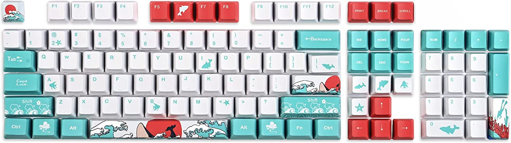

Pictured: 108 key keyset, via [Amazon](https://www.amazon.ca/Japanese-Keycaps-Percent-Mechanical-Keyboard/dp/B0936TN1JJ)

The above keyset will provide support for standard 60% (ex. Pok3r) ANSI (this means **not ISO**, this means **not European** usually) layouts, ANSI TKL’s, and ANSI full-size keyboards. However, what are you to do if you have a board you want to put keycaps on that even deviates slightly from this? You’ll be out of luck without the proper 1.75u right shift that you might need, or the 1u Control/Function/Alt keys that you need.

The real question that you’re asking is: “How do I know what I need?” For keyboards that have a less-common layout (i.e. not 6.25u spacebar 60%, TKL, or full-size), the reading below will attempt to explain what you need to look for to support your own board in diagrams of keysets.

### Extensions To Look For

If you know your board layout, then you can see which individual keys you need so you can hunt for them in the kitting diagrams provided with every keyset. This chart is wholesale stolen from [the excellent KDD Info & How-To guide written by Buburoo](https://docs.google.com/document/d/1jjQghqjGP6BasZt4i0zTmK4p-gN_3IRhIAm2-CPE0kE/edit#).

Note: the piece on "different/additional shifts" denotes

- 2u shift support for GK64 and Womier K66/YC66 support
- 2.25u shift support for Leopold FC660-type layouts
- 1.75u shift support for most 65%, 75%, 96%/1800, and split right shift layouts

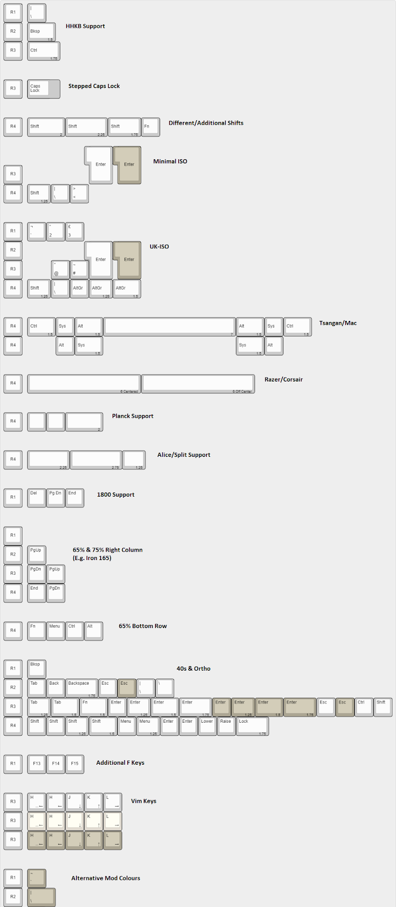

Now with this information known to you, you can probably start reading kitting renders for support like I have in this diagram below -

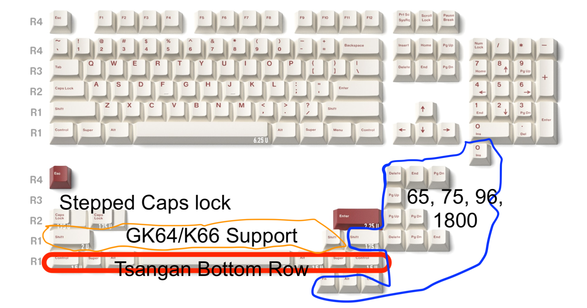

Pictured: JKDK RoW (Red-on-white), annotations by me

### Example: A Well Kitted Keyset

Pictured: “Cherry Taro”, designed by pwade (via [Novelkeys](https://novelkeys.com/products/cherry-taro)), annotations by me

Here’s a good example of a base kit that provides very flexible kitting! You may not use all of it, but you’ll likely be able to use it on most/all of your boards, barring those with unpopular and esoteric layouts. You get

- Mod pipe and mod tilde (some prefer their look on 60’s)
- F13 key (nice for F13 TKL's or some exploded 75%'s)
- Stepped caps lock and 1.75u Control on R3 (nice to have for HHKB-style layouts)
- Physical ISO compatibility (ISO enter, R3 1u pipe, 1.25u left shift R4, and >< key beside left shift)
- Flexible 65%, 75%, and 1800/96% support
- Split backspace (R2 1.5u backspace, R1 pipe)
- Split bars (predominantly for Alice-layout spacebars support, may support other less-common layouts as well)
- 6u spacebar for stranger layouts
- Minivan (popular 40% layout) (R2 1.75u backspace, R3 1.25u Tab and 1.5u Enter)
- Extra shift keys
  - 2.25u right shift to support FC660M-style layouts
  - 2u shift to support GK64-like layouts with 2u left shift and arrows or Womier K66/YC66 2u right shift
  - 1u shift to support right shift on GK64-like layouts

## How To Find A Bad Keycap Set

### Reading Reviews

Reading reviews from people who have actually purchased a keyset is more advisable than asking someone who has never bought the keyset you’re about to purchase. Reviews provide some context towards the quality of a product, and the high chance that users have submitted photos of what their keyset looks like on arrival. Don’t get caught by renderbait! Yes, a cell phone camera shot plus your gaming monitor probably won't reproduce accurate colors, blah blah blah, but come on, it's better than going off of the renders from a vendor.

### Poor Legends Quality

#### Poor Printing

| Genuine GMK Darling                                                                                                                                     | PBT Darling Clone Example 1                         | PBT Darling Clone Example 2                              |
| ------------------------------------------------------------------------------------------------------------------------------------------------------- | --------------------------------------------------- | -------------------------------------------------------- |
|                                                                                                                    | 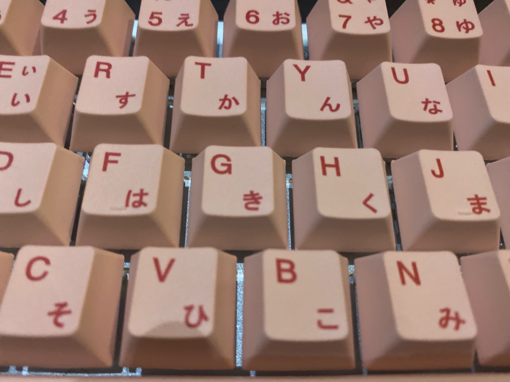 | 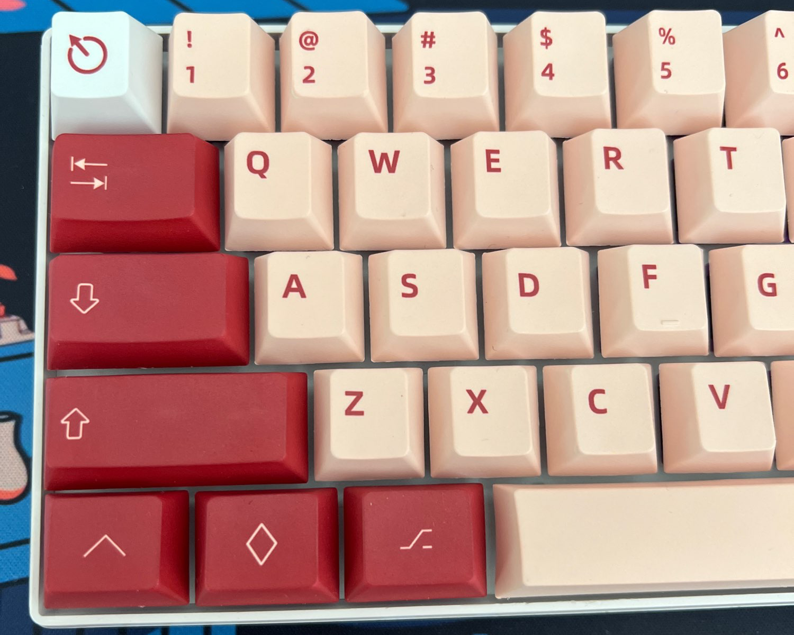      |
| via [MyKeyboard.eu](https://www.facebook.com/mykeyboard.eu/posts/gmk-darling-by-xerpocalypse-is-here-and-it-starts-shipping-out-today/2796713847241440) | Poor color matching and different legends font.     | Poor color matching, different font, missing sublegends. |

| [ePBT Dreamscape Render](https://geekhack.org/index.php?topic=113377.0) | HK Gaming Dreamscape                                                                                                                |
| ----------------------------------------------------------------------- | ----------------------------------------------------------------------------------------------------------------------------------- |
| 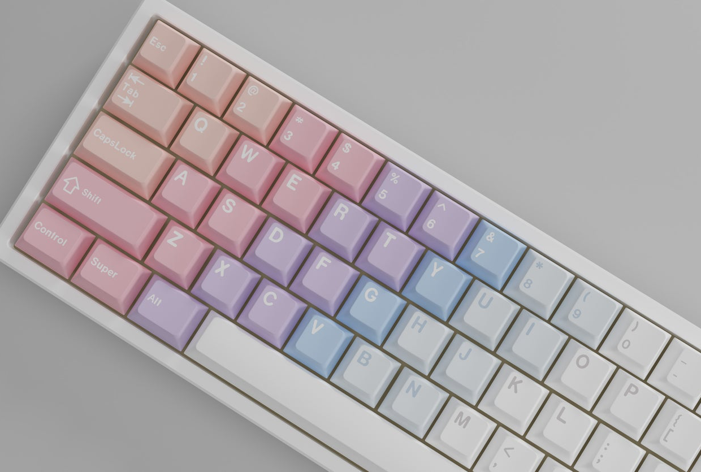                    |                                                                |
| Designed by tsoiab10                                                    | Left side of the gradient does not have white legends like the original set, implying HK Gaming cannot/will not do reverse dye sub. |

#### Poor alignment

| JKDK BoW (black on white)                                                                | SRP Pseudo-Handarbeige                                           |
| ---------------------------------------------------------------------------------------- | ---------------------------------------------------------------- |
|  | 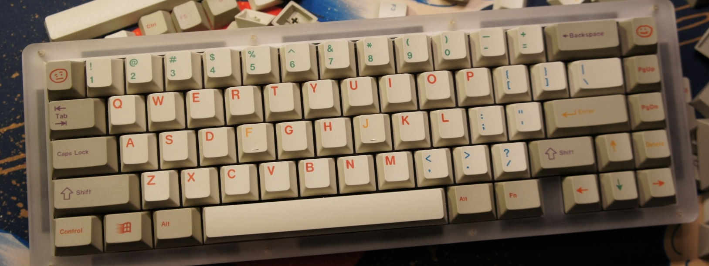 |
| via JKDK message to cardio (“That shift is flying away”)                                 | Sinking Tab and Pipe legend, short backslash legend vs pipe      |

| KAT Arctic                                                                                    | qPBT Terminal |
| --------------------------------------------------------------------------------------------- | - |
| 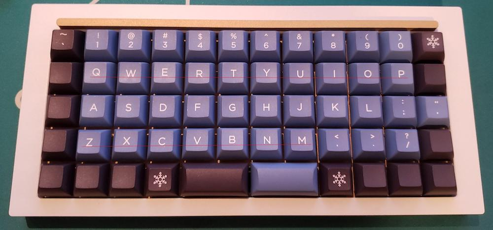              |  |
| [via catbus from geekhack](https://geekhack.org/index.php?topic=106046.msg3066824#msg3066824) | [via fnv_fan from reddit](https://redd.it/uto7tq)

#### Mold quality

| Winmix/Catcher Olivia clone, doubleshot PBT                                                                                                                                                         | "Shell Studio" "PBT Blush" (Doubleshot PBT Olivia clone)                                                                                                                                                       |
| --------------------------------------------------------------------------------------------------------------------------------------------------------------------------------------------------- | -------------------------------------------------------------------------------------------------------------------------------------------------------------------------------------------------------------- |
|                                                                                                                                  | 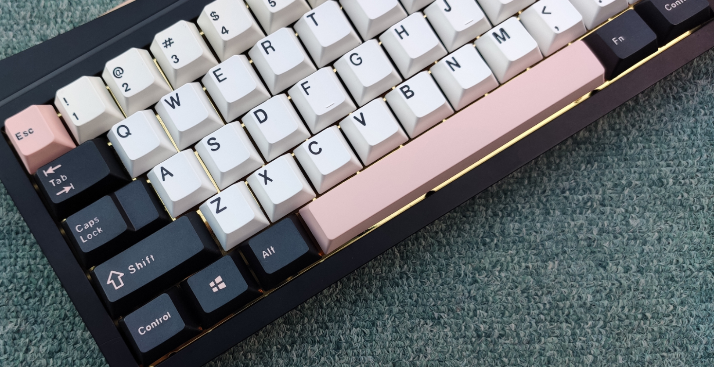                                                                                                                                         |
| via AliExpress reviews. Lack of icon legends on the modifier keys are a dead giveaway to this being a clone. I'm personally not a fan of the font used. Also, what’s the deal with “CapsLock”, man? | From [imgur album](https://imgur.com/a/CufPcmV) provided by /u/RatratanX from Reddit. Via their description, “You'll get what you paid for. Uneven thickness of legends. Still lucky no problems on mounting.” |

| Winmix OSA Doubleshot PBT                                                              | Aifei clone of GMK Jamon                                                        | Domikey Dolch (Cherry profile)                                                                                                   |
| -------------------------------------------------------------------------------------- | ------------------------------------------------------------------------------- | -------------------------------------------------------------------------------------------------------------------------------- |
|                                         |                    |                                                                       |
| via /u/denker88 on reddit. Legends are fine with the exception of one prominent issue. | via AliExpress review. Note the inconsistent letter sizes on the modifier keys. | Decent legend quality, but someone with a very fussy eye might make a stink about the spacing between the “F” and “T” in “Shift” |

### Poor kitting/compatability

Please refer to [the kitting section](#on-kitting-or-how-to-read-a-kitting-diagram) for more detail, but a bad keyset is one that is going to omit support for boards you either have currently, or plan on having in the future.

### Warped Bars

Early ePBT sets and some Geekark sets are known to have bars for stabilized keys that were significantly warped, and required intervention to un-warp them. These things have been solved, but some cheaper PBT sets with bars that don’t have rigidity ribs may warp as the injected plastic cools, and might require a dip in very hot water to soften it up enough for you to un-warp them. NOTE: DO NOT ATTEMPT THIS WITH ABS, YOU WILL MELT YOUR KEYCAPS.

| Winmix SA Retro Spacebar                               |
| ------------------------------------------------------ |
|   |
| [via salt rock lamp#0679](https://imgur.com/a/qjPj6E9) |

### Stem Twist

Plastic tends to warp to some degree on cooling, and with PBT from a cheap manufacturer that isn't subject to rigorous quality control, the issue is fairly present; there are two areas where this issue inherent to the material becomes apparent:

1. Stabilized bars have their ends bow away from where they should rest, so they form a mild U-shape.
2. The cap and the stem begin to twist just a little.

Stem twist is hidden when caps are in their tray/bag, but obvious once mounted.

| Winmix SA Retro, Alt Key                                    | Winmix SA Retro, Alpha Keys                                     |
| ----------------------------------------------------------- | --------------------------------------------------------------- |
| 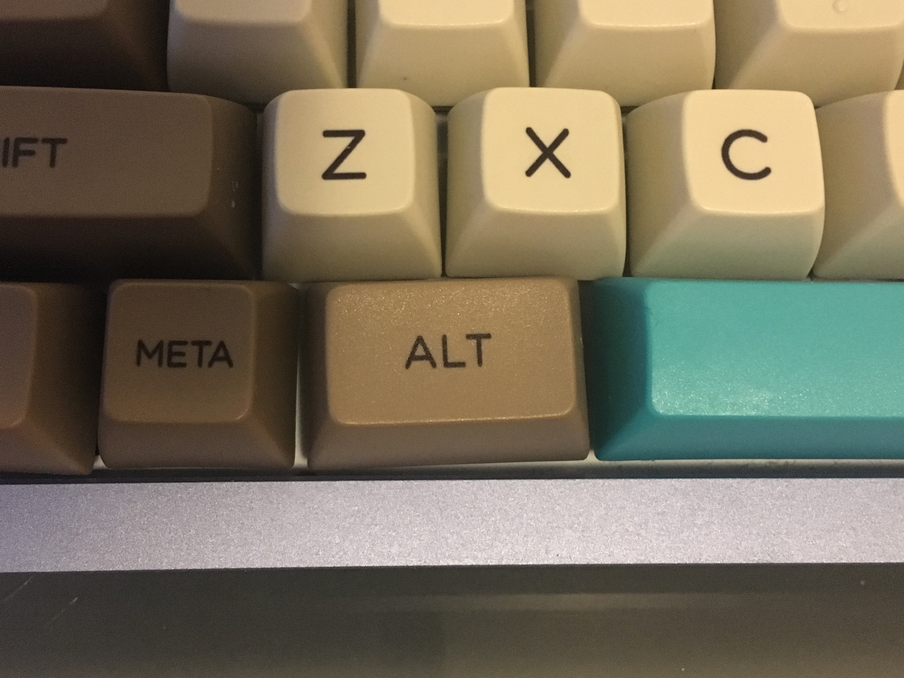 |  |
| [via salt rock lamp#0679](https://imgur.com/a/qjPj6E9)      | [via salt rock lamp#0679](https://imgur.com/a/qjPj6E9)          |

### Reverse Dye Sublimation

Where dye-sublimation is the process of printing a design onto a keycap by applying pigment to a specific area, reverse dye-sublimation is the process of printing a design onto a keycap by applying pigment **everywhere but** a specific area. There are two significant issues:

#### Reverse Dye-Sub Shrink

In reverse dye-sublimation, heat gets applied to **every face of the cap**. Under enough heat, PBT can shrink somewhat, so the gap between keys becomes more obvious than normal, and stabilized keys may shrink so much that the stems do not fit where stabilizer inserts go.

| 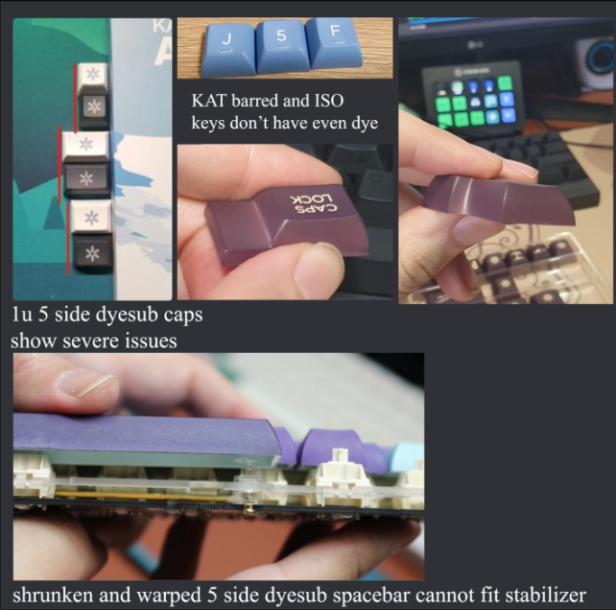 |
| ----------------------------------------------------------------------------- |
| Effects of flawed reverse dye-sublimation on KAT keycaps. Original author (presumably from GeekHack?) unknown, my apologies. |

#### Reverse Dye Sublimation Fade

| 5-side dye sublimation | Cheap GMK Striker clone |
| ---------------------- | ----------------------- |
| | 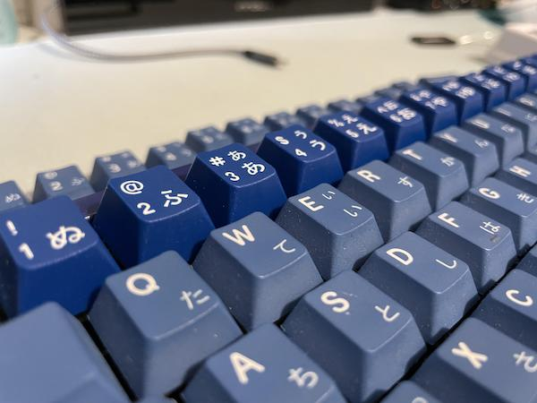|
| [via Keyreative](https://en.zfrontier.com/blogs/project-updates/202101-kat) | [via /u/CatboyMac](https://www.reddit.com/r/MechanicalKeyboards/comments/yfw07z/) |

The dye-sublimation paper isn't exactly cut to fit the shape of each side of a keycap; rather, it appears in the example from Keyreative that it is stretched over the cap, especially over the sides. Therefore, the pigment is more spread out, explaining the faded look as the white blank cap is more visible.

### Geekark Stems

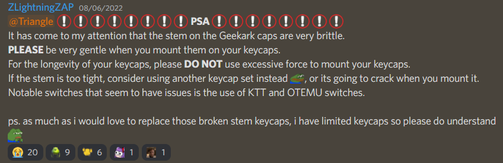

### Thickness

TODO: Fill this out

## Why expensive?

> "Everything's too expensive! You people are stupid for buying this crap! I can't believe you're telling me to spend \$140 USD on keycaps! I don't have \$160! Shame on you for thinking I can spend \$175 on plastic! I'm going to go buy clones ten times over before you think I'd spend \$200 on a base kit! I'm leaving this (server/website/courthouse/baby shower)!

Yes, you're correct, some of these sets do cost a fair amount of money. While some companies commit unsavory business practices like misrepresenting their product to make you think you're getting a good deal (often mislabeling some ABS resin mix as PBT) or using actual child labor to provide you with that cheap Matcha XDA keyset with hiragana sublegends that you bought last week, other manufacturers production costs are more expensive for some justifiable reasons.

Generally, expensive caps are a result of higher quality caps made of better quality resin, not smelling like a sewer when you unbox them, attention to detail for colors and legend alignment, manufacturing in areas with higher costs of living, and smaller batches shrinking the economy of scale. These expensive caps usually start going about once you start heading into the >$100 USD ranges for a set. 

Mostly for the enthusiast, wait times too long or too expensive? Don't buy it then or find alternatives in-stock. Major vendors like Novelkeys, Cannonkeys, and Drop have many high quality GMK, SA, and other sets in stock all the time, mostly from GB extras.

## Who's Who

### GMK

Doubleshot ABS, about 1.4mm thick. They're manufactured in Germany, and therefore pay German costs-of-living and German wages. If anything, it's impressive that the Germans can produce a keyset for not much more than similar Chinese-manufactured made-to-order keysets, given a significantly higher cost of living. Kitting is **very** extensible, especially compared to other doubleshot keycap manufacturers who are limited to 1 kit. If your keyset designer is competent at color matching, and the renderer is also competent, they provide the most consistent experience for a customer. 

Recent complaints of the company include long manufacturing times, color mismatch, their eco friendly trays, and certain QC issues with warped keys. 

| Complaint | Response |
| --------- | ----------- |
| The long queue times are unnacceptable! Gimme now! | With COVID, the massive increase of the hobby, locking down to protect workers from COVID infection, and the inherent difficulty in sourcing resin reliably outside of China, GMK had some time where production was outpaced by orders placed/demand. While this isn't the place for a document to debate with you on if GMK has acted "unethically" in accepting more sets in a month than they can produce (fwiw, it's literally business, grow up), significant delays in set production are non-unique to GMK, if you pay attention to issues with GB fulfillment from other made-to-order manufacturers like Milkyway, Keyreative, Signature Plastics, and JTK. If you simply cannot wait for a set to fulfill, Drop consistently stocks GMK sets, and other vendors like Novelkeys or Oblotsky Industries do well to stock plenty of extras after a GB has fulfilled. You may have to pay the Patience Tax to pay for an extras set or preorder. |
| Colormatching Issues | GMK is able to make and match colors very close to specified color codes (supporting RAL and Pantone on top of their stock colors), although it may take time and multiple sampling runs to satisfy a designer. It is up to the designer and vendors to properly communicate these colors to customers through accurate and professional renders, or photographing color chips in real-world lighting. Instances similar to Nautilus Nightmares' mismatched renders, GMK's default renders of Plum and Necro (note: GMK is not a render company), or even GMK Bread's rogue unannounced color change mid GB, but this is the work of designers signing off on samples. |
| These trays stink! | German regulations pushed the swap from plastic trays to ones made out of biodegradable potato starch. These bio-degradable are known to disintegrate over time and are not the best means of long term storage, but it would be hard for GMK to back on this decisions as they have already made the choice to be eco-friendly. Recent retooling of these trays prevents caps from getting jumbled around in transit. |
| Quality Control | Warped bars are problematic, sad to see, but invetivable with the ammount of plastic they pump out. Instances are not the most common, but can be fixed on the occassion with certain methods. Concerns are valid and purchase elsewhere if you want to avoid it. |
| ABS shines too fast! | Yeah. ABS wears out. Buy a set you're sure you'll like for a while and want to keep and not one that you'll plan on selling after using the caps for two weeks, and it'll be less of an issue. Shine shows that you cared about these caps, and you enjoyed using them. |
| There's UV print on keys with more than two colors? I hear UV print wears out fast! What a load of crap! | [Only if the manufacturer sucks! Notice how the shine hasn't wiped off the legends off these?](https://www.reddit.com/r/MechanicalKeyboards/comments/b3cm79/hbcp_griseann/) |
| You're caping for GMK! You're a shill! | mad because bad |

### Signature Plastics (SP)

Manufactured in America, SP provides flexible kitting and wide customizations, and are known for excellent communication with their customers (vendors or designers). They even offer one-off sets for a somewhat hefty price. DCS (a profile similar to Cherry) lead times have suffered significant growth due to a brief stint of popularity after designers migrated their sets to DCS to avoid the unpopularity of GMK lead times among potential customers, and SA lead times remain rough (due to significantly more resin used for that profile over the other profiles they offer). DSS and DSA lead times remain good. While their made-to-order sets tend to be doubleshot ABS, they do offer some limited dye-sublimated PBT options. Their SA is nearly glossy-smooth, DCS is moderately textured, and ABS DSS and DSA sets are aggressively textured. DSS, DSA, and DCS are all on the thinner side, while their SA is fairly thick. Their lead times are prone to ballooning quickly after accepting a few orders of GB sets.

### JTK (JT Keycaps)

Cherry profile keycaps in doubleshot and tripleshot hiragana, cyrillic, and US-International (Griseann/Royal Alpha) ABS. Thickness is comparable to GMK. They are somewhat infamous for significant delays (such as with HSA) and slow communication with designers and vendors, even prior to covid. Their molds quality is moderately good, although more seasoned customers may have quibbles with the consistency of the thickness of the lines in some letters in their molds. Texture is a little more slick than GMK or DMK.

### DMK (Domikey)

#### Cherry profile

Doubleshot and tripleshot hiragana and cyrillic (with supposedly upcoming Hangul) tripleshot molds. Thickness comparable to GMK. Lead times appear to be very good, although it appears their load is managed by running few made-to-order keysets. The alphas are high-quality, their space bars are very straight, but the quality of the molds on the icon+text modifier keys should be noted, as it appears the letters bleed out a little bit. The caps themselves are textured moderately, which I find pleasant.

#### SA profile

`>.` key legend is kinda sinking compared to the other keys. Otherwise fine, has shiny/glossy finish like SP SA.

### EnjoyPBT (ePBT)

Moderately thick PBT of average smoothness with solid dye-sublimation with recent capabilities for reverse dye-sub on every key. ePBT is currently suffering from significant production delays.
Avoid their doubleshot ABS sets, as the molds on those are of lower quality, inconsistent thickness on the alpha legends, and known to sometimes collide with switch housings even when switches are south-facing.

### NicePBT/CannonCaps (CannonKeys Dye-sub)

NicePBT is composed of the **very** thick (1.7mm) blanks, while CannonCaps makes up the medium thick blanks (1.4mm). CannonCaps have very very smooth texture, while NicePBT is a bit more textured. Their kitting tends to be one large base kit that provides solid 40's and split bars support. Limited reverse dye-sublimation. A decent buy for those not trying to buy keycaps directly from China. Legend quality is improving. NicePBT is very smooth texture, CannonCaps (dyesub) is EXTREMELY smooth texture, perhaps on-par with (if not smoother than) CRP.
There is some reverse dye-sub fade on the sides of the keycap, but you definitely get your money's worth in kitting.

### Shenpo/Godwife/Goddess Dye Sublimation

Thick blanks presumably sourced from the same blanks manufacturer as NicePBT and XMI/21KB (albeit with small differences). Known for doing a few keysets similar to OG Dyesubs or CRP (such as Green Hebrew, SAV, OG Triumph Adler, Xerox 6001, 6002), and a few clone sets, and a few sets designed on their own. Decent print quality at a very competitive price (~$35 USD). If you're not buying directly from Taobao, Keebox on AliExpress is generally the way to go. Very smooth texture.

### XMI/21KB

Xiami/XMI/Shrimp Research is literally a dude with a dye sublimation machine who has pretty good accuracy/alignment printing on beige keycaps. Thick (1.6-1.7mm) blanks presumably sourced from the same blanks manufacturer as NicePBT and Shenpo (albeit with small differences). So thick they sound a bit dead to some. Absolute smorgasboard of different sublegend options. 21KB is the Western proxy. Very smooth texture. 

### PBTFans

KBDFans's in-house manufacturing setup. Genuine doubleshot and tripleshot PBT, although they do sell ABS-based sets, such as for the sets that have translucent keys. Decent approach to sales where most sets designed by outside designers are run in-stock, so there are a lot of sets for sale in-stock via KBDFans and regional proxies that want to stock PBTFans sets. They feel nice enough, maybe slightly thicker than GMK. Molds appear to be moderately textured like GMK. Only quibble is that you might not like the font used for the molds.

### Milkyway/MW

A new manufacturer that advertises large kitting flexibility and lower pricing, as well what appears to be a novel approach to reverse dye-sublimation. PBT smoothness is about on par with other manufacturers.
Color-matching (case: MW Demon Girl) and alignment (cases: MW Cat PBT, Bolsa Supply WoB Hiragana, MW Demon Girl) appear to be troubling. Reverse dye-sublimation sets appear to be heavily impacted by delays, as well as delays of "oh we have to completely remake our blanks molds because we've noticed that some keycaps are getting manufactured with scratches in them."

### Keyreative

Known for producing KAT (sculpted) and KAM (uniform profile) keycaps. A manufacturer that offers very attractive MOQ targeting based on total units sold instead of individual kits. They are suffering a significant backlog exacerbated by converting some sets that were advertised by designers as reverse dye-sublimation to doubleshot manufacturing and constant lockdowns. QC appears to be inconsistent too, as past sets have had somewhat fuzzy dye-sub, sub-standard alignment, significant amounts of keycap shrink with their reverse dye-sub process, reverse dye-sub peel (most famously with KAT Space Cadet). Their dyesub PBT is velvety smooth, can't speak to their doubleshot yet. Keyreative is also infamous for poor communication with designers, having shipped keysets **multiple times** without announcing it to designers.

### Infinikey (IFK)

TheKeyCompany's front-end for a manufacturer that offers all-over dye-sublimation Cherry profile and DSA keycaps. Their quality is simply *alright* (alignment is a bit off at times, and their font options aren't for everyone). They are moving from running group-buy sets to in-stock sales.

### Keykobo

Another new kid on the block. Molds appear to be very close to what GMK/Cherry font looks like. Decent timelines, but MOQs appear to be fairly high (and not well-known) after Geon & Novelkeys bought out a **lot** of their BoW/WoB sets. Early sets appear to be impacted by a mistake in manufacturing tolerances, so beware of keycaps cracking if you buy those earlier BoW/WoB/Sea of Clouds keysets.

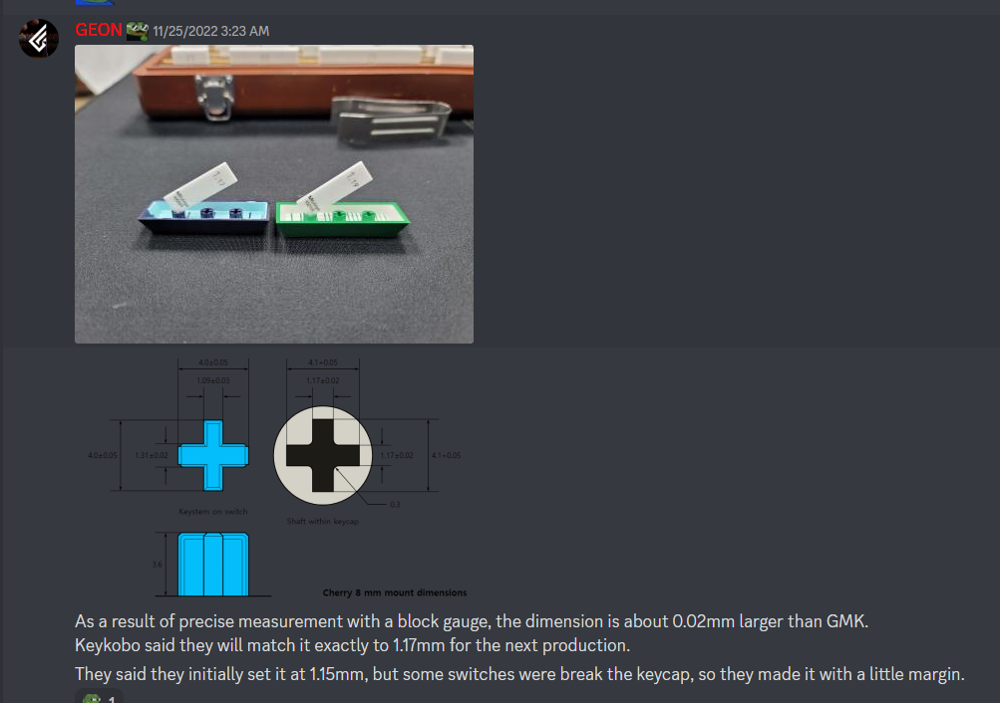

### Hammerworks/CRP

Very smooth (to the point where they shine faster than textured PBT), moderately thick. Comes in two colors: beige, and white. They don't run group-buys that often, so be prepared to pay the aftermarket tax if you want any.

### Drop

### MT3

Tall, spherical sculpted keycaps. Manufactured by Geekark. Can either be doubleshot ABS or dye-sublimated PBT. The PBT stuff is on the smoother side, has a history of rough dye-sub bleed.

#### DCX

Drop's take on Cherry profile. Doubleshot ABS. Much less textured than GMK, JTK, or DMK. Otherwise fine, if you're okay with the legends font.

#### DCD

Very very smooth, like CannonCaps, NicePBT, XMI, and CRP. Dye-sublimation PBT. Mostly fine.

## Aifei (爱菲)

One of the larger keyset clone manufacturers in China. Molds on modifier keys on their Cherry profile sets don't look incredible. Kitting is fixed due to waffle molds - what you see is what you get, which usually means more accent/mod colored bars than alpha-colored bars. Their Cherry-profile caps are purportedly made up of one shot PBT and one shot ABS, which probably explains why half of the resellers market them as ABS, and the other half market them as PBT. Do not expect high quality resin, you get what you pay for. Their take on Melgeek MG/Signature Plastics SA style of tall and spherically sculpted keycaps is referred to as AFSA profile: good value for money (lots of resin), and legends that don't loook terrible.