# Is this good?

## A starter guide to buying parts for mechanical keyboards that take Cherry MX-style switches

 THIS IS A LONG DOCUMENT CURRENTLY, SO PLEASE JUST CTRL/CMD-F YOUR WAY INTO FINDING SOMETHING THAT MAY APPLY TO YOU. THERE IS ALSO A TABLE OF CONTENTS PROVIDED.
 Feel free to file pull requests or issues for information you wish to be added, or political complaints.

Answer: *Good is a question for moral philosophers to answer, and that’s not who we are. There is no good and there is no bad; there are merely different products that fulfill different needs and niches. A prebuilt like a Leopold or a Varmilo may be “good enough” for someone who only wants a mechanical keyboard and not to have to think about it too much. Gateron Browns may be “good enough” for someone who isn’t asking for much more than a light bump in their press. $30 AliExpress keycaps might be good enough for someone who doesn’t want to look at thin shinethrough ABS anymore. Maybe you want thin shinethrough ABS because you don’t care much about “thickness”! And so on. Now, never ask me if something is “good” ever again.*  

This guide is here to help you figure out if the thing you're considering buying will meet or not meet your needs and expectations. You don't have to read all of it, but I ask that you provide some care into giving the relevant parts a solid read-over, lest you risk turning someone helping you in #kb-help or #kb-buying advice from passive to aggressive. There may be advice here and there about what parts may work together, but for the most part, you may need to use your brain still.

This is not a complete guide to be solely relied on, but a supplement to a set of information I am confident that you can find on your own with reasonable use of your favorite web search engine, YouTube (with information from there taken with grains of salt), the pins in the MechKeys Discord Server, and so on. Also please be considerate to the guide’s revision date, as certain aspects to the keyboard meta may be out of date by the time you read this.

This is mostly folk knowledge and should thus be taken with a grain of salt. This is based on first-hand reports from myself, my co-writers, second-hand reports from friends and people I trust, and is thus subject to being viewed through the lenses of their unspoken and possibly conflicting preferences. Please be mindful of this while reading.

Also, I have not finished writing this. Please help.

Thanks,

zhol (with assistance from moosh, chickenman, and Daniel)

- [Is this good?](#is-this-good)
  <!-- - [A starter guide to buying parts for mechanical keyboards that take Cherry MX-style switches](#a-starter-guide-to-buying-parts-for-mechanical-keyboards-that-take-cherry-mx-style-switches) -->
  - [Prebuilt Keyboards](#prebuilt-keyboards)
    - [Non-standard bottom row layouts](#non-standard-bottom-row-layouts)
  - [Keyboard Kits](#keyboard-kits)
    - [Firmware Support](#firmware-support)
    - [Switch orientation](#switch-orientation)
    - [Boards We Have Feelings About](#boards-we-have-feelings-about)
      - [Any Optical Board](#any-optical-board)
      - [Some Skyloong Optical Kit (SK6*/GK6*, SK87, etc.)](#some-skyloong-optical-kit-sk6gk6-sk87-etc)
      - [Some Skyloong Mechanical Kit (GK6*X, GK87, etc)](#some-skyloong-mechanical-kit-gk6x-gk87-etc)
      - [TM680 (Wired)](#tm680-wired)
        - [LK67](#lk67)
      - [Royal Kludge Boards](#royal-kludge-boards)
      - [Tofu60 case](#tofu60-case)
      - [DZ6* (DZ60, DZ65) PCBs](#dz6-dz60-dz65-pcbs)
  - [Keycaps](#keycaps)
    - [On Clones](#on-clones)
    - [On Kitting, or, How To Read A Kitting Diagram](#on-kitting-or-how-to-read-a-kitting-diagram)
      - [Extensions To Look For](#extensions-to-look-for)
      - [Example: A Well Kitted Keyset](#example-a-well-kitted-keyset)
    - [How To Find A Bad Keycap Set](#how-to-find-a-bad-keycap-set)
      - [Reading Reviews](#reading-reviews)
      - [Poor Legends Quality](#poor-legends-quality)
      - [Poor kitting/compatability](#poor-kittingcompatability)
      - [Warped Bars](#warped-bars)
      - [Thickness](#thickness)
  - [Switches (The Switch Meta)](#switches-the-switch-meta)
    - [Gateron](#gateron)
      - [Inks](#inks)
      - [Zeal](#zeal)
    - [Durock/Everglide/JWK](#durockeverglidejwk)
      - [Everglide Aqua King/Water King](#everglide-aqua-kingwater-king)
    - [Outemu](#outemu)
      - [Gazzew x Outemu “Boba” Switches](#gazzew-x-outemu-boba-switches)
    - [Tecsee](#tecsee)
      - [PME Housings](#pme-housings)
      - [UHMWPE/PE Mix materials](#uhmwpepe-mix-materials)
    - [Cherry](#cherry)
      - [Hyperglide](#hyperglide)
      - [Non-Hyperglide “Retool”](#non-hyperglide-retool)
    - [TTC](#ttc)
    - [Kailh](#kailh)
      - [Full POM Housing (Creams, Blueberries, etc.)](#full-pom-housing-creams-blueberries-etc)
      - [Box Tactile](#box-tactile)
      - [Cream stem stand-ins](#cream-stem-stand-ins)
    - [KTT](#ktt)
  - [Switch openers](#switch-openers)
  - [Stabilizers](#stabilizers)
    - [PCB Mount Stabilizers](#pcb-mount-stabilizers)
      - [Recommended](#recommended)
      - [Not Recommended](#not-recommended)
      - [Be aware of issues](#be-aware-of-issues)
    - [Plate Mount](#plate-mount)
  - [Lubricants](#lubricants)
    - [A quick reference](#a-quick-reference)
    - [Housing And Stem For Switch And Stabilizer](#housing-and-stem-for-switch-and-stabilizer)
    - [Switch Spring](#switch-spring)
    - [Stabilizer Wire Lubricant](#stabilizer-wire-lubricant)
  - [Films](#films)
    - [Materials](#materials)
    - [Switches that Films Don’t Work Good in](#switches-that-films-dont-work-good-in)
      - [Winglatch Housings](#winglatch-housings)
      - [Misc. Cases](#misc-cases)

## Prebuilt Keyboards

Believe it or not, you may not require something as robust as whatever build that some Keyboard YouTuber is showing off with a $700 price tag in the preview thumbnail! A healthy mindset recognizes that a keyboard is a tool, and either your tool works for you, or works against you; a good prebuilt board will work for you, and get everything you need without getting in your way.
Things to keep in mind:

- The Good Brands
  - Some brands are preferred by the MechKeys server than others. Leopold is known to have binned (cherry-picked) Cherry MX switches. Them, Varmilo and Keychron are known to apply some grease on their stabilizer wires to prevent stabilizer rattle. ABKO makes tanks, and so on.
- Plate mounted stabilizer limitations
  - Most prebuilts have their PCBs wave-soldered together, which is a process too hot for most PCB mounted stabilizers to survive; hence, most prebuilts are built with plate mount stabilizers. They will generally be unable to be upgraded with other PCB mount stabilizers.
- Factory lube on stabilizers
  - Some gamery prebuilts will probably lack this, since stabilizer wire rattle is part of the fun! Other manufacturers (Leopold, Varmilo, Keychron) will have some sort of grease applied to the stabilizer wires on your boards and reduce rattle. If you don’t intend on injecting your stabilizer housings with Superlube, this is nice to have!
- Non-Standard Bottom row layouts (ex. 6.5u spacebar on some Corsair layouts)
  - Non-standard bottom row layouts can make finding compatible keysets between a little tricky (ex. Womier K66) to nightmarish (Corsair K70).
- Non-Cherry MX switches
  - Common switch manufacturers you’ll find in prebuilts are Gateron, Kailh, Outemu, and maybe TTC in a few cases. Most are decent and punch above their weight comapred to Cherry cost. Sure, they'll have some amount of scratch and spring ping stock
  - Supposedly HyperX is just rebranded Gateron, Keychron branded switches are just rebranded Huano’s (not great), Logitech’s GL’s are Kailh Chocs, Logitech GX are just Kailh.
  - Omron Romer-G: unpopular switch, tactility is unimpressive
  - More information about the switch manufacturer meta [here](#switches-the-switch-meta)
- Hotswap support is not found on many prebuilts, but when it’s found, it’s nice to have!
  - Kailh hotswap is reasonably good hotswap that can arrive in a prebuilt, and it supports most-all Cherry MX clone switches.
  - Quality of TTC hotswap is unknown, but presumably good.
  - Gateron hotswap provides similar compatibility (most to all Cherry MX clone type switches) as the above two, but the QC seems to be worse, between leaves having a greater tendency to bend the wrong way, or the portion that is soldered to the board snapping off of the plastic socket part. Moreover, the contact leaves have a slightly greater tendency towards getting bent the wrong way, and this may have to do with their reduced reliability vs Kailh hotswap sockets.
  - CIY hotswap is known to have fairly weak contact leaves, to the point where a CIY hotswap socket can hardly retain a switch by the pins like the above hotswap sockets can.
  - Outemu hotswap is a rivet that can be installed onto PCB’s cheaply and easily, but compatibility is much more limited than with Kailh/Gateron/TTC/CIY style sockets. This sort of hotswap is found only on prebuilts.
    - Compatability for other Outemu switches and KTT (includes Akko CS) is known.
    - Huano stuff like Feker Pandas have mixed reports on support.

### Non-standard bottom row layouts

Some bottom row layouts on *some* prebuilts will have strange width spacebars that are less easy to find replacements for than your traditional 6.25u or 7u spacebar.

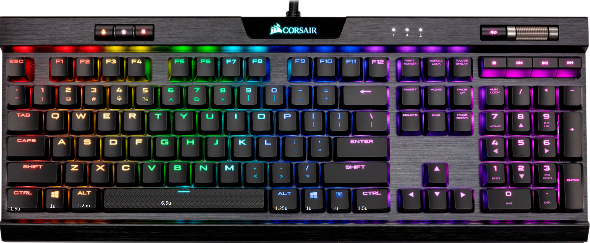
Pictured: Corsair K70, via [Best Buy](https://www.bestbuy.com/site/corsair-k70-rgb-mk-2-low-profile-rapidfire-full-size-wired-mechanical-cherry-mx-low-profile-speed-switch-gaming-keyboard-black/6298657.p?).
Note the 6.5u spacebar.

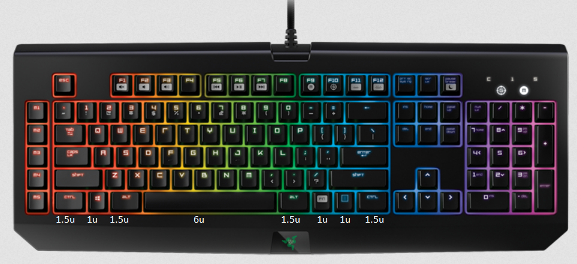
Pictured: Razer Blackwidow Chroma v1, via [Razer](https://www2.razer.com/br-pt/gaming-keyboards-keypads/razer-blackwidow-chroma-v1).
Note the 6u spacebar.

## Keyboard Kits

### Firmware Support

Being able to reprogram your keyboard with your preferred key layout or fun features is one of the significant benefits of having a fancier keyboard. If programming custom key layouts or macros is something you're interested in, then this is something you may want to note.

- Worst: No software - what you see is what you get!
- Kinda Bad: China software
  - No idea if you’ve installed a rootkit or not. (You probably haven’t, but still).
  - Poorly documented, only occasionally translated to English, and sometimes impenetrable.
- Not Ideal: Proprietary Software that you need to keep installed.
  - Often not easy to understand or use, confusing, and bloatware.
- Acceptable: Non-mainlined QMK support
  - Some PCBs will advertise that they run QMK/VIA, but they haven’t had their firmware merged to [their Git](https://github.com/qmk/qmk_firmware/tree/master/keyboards) yet; these only will ship some .hex/.bin file to be flashed with QMK Toolbox/equivalent command line tool.
  - Likewise, if the layout JSON hasn’t been merged to the-via yet, then you will need to take the .json layout file that the vendor provides, and side-load that into VIA Configurator. It’s one more step, it’s not the worst thing in the world..
- Best: Out-of-the-box QMK + VIA/VIAL support
  - You can compile it! You can adjust your keymaps and flash! You can enable features not included in the shipped firmware or binary! Wow!

### Switch orientation

Look, most of these cheaper kits you’ll find on Amazon, AliExpress, or BangGood are going to have north-facing switches, which will slightly limit the set of keycaps you can use on your keyboard. (For more information, message !northfacing within the help channel in mechkeys)
Budget keyboard kits that are easily available having south facing switches are more of an exception to the rule than the rule itself, but you can still find them with a bit of looking around.

### Boards We Have Feelings About

#### Any Optical Board

Most of these are not great. Optical boards only work with optical switches. Even if yours are hotswap, you cannot use mechanical switch bottoms, your options for tactile leaves are zero-to-limited, and actuation distance will be weird if you stem swap; you’re shooting yourself in the foot if you want to upgrade your switches. The sensors for optical keys sometimes just don’t work or break, and don’t always take to lube great (don’t lube your stem poles, please). And most importantly, optical switches won’t make you play games better. A laser does not improve latency. Your performance as a gamer will not improve.

#### Some Skyloong Optical Kit (SK6*/GK6*, SK87, etc.)

Even if they say that they are hotswap, you cannot put mechanical keyboard (Cherry MX/Cherry MX Clone) switches into these; these boards take only (generally Gateron) optical switches.
A mechanical switch keyboard PCB does not take optical switches.
An optical switch keyboard PCB does not take mechanical switches.

#### Some Skyloong Mechanical Kit (GK6*X, GK87, etc)

USB port likes to lift off a little too easily. Software sucks to use, not documented very well, is not reprogrammable without it actively running, mediocre build quality. Beyond that, if you pick up one of these, you'll live.

#### TM680 (Wired)

Don’t. I’m telling you now, don’t. I know you love the knob. The QC on the PCB is known to be significantly poor, and so your PCB may have individual keys’ RGB die, individual switches die, or the PCB may stop working outright.

##### LK67

The case may be the same, but the PCB may be designed by someone more competent this time. Hard to say. Purchase cautiously.

#### Royal Kludge Boards

RK61 PCB is somewhat wonky. Software doesn’t find it all the time. A handful of users have come into the help channel in the past to figure out why their PCB doesn’t work (switch doesn’t work, won’t connect to software, computer fails to detect keyboard), more than DZ60 users who just need to be reminded to reset the EEPROM on their board.

RK61 and RK68 PCB have RGB LEDs mounted on the surface only accept SMD-compatible switches - this means that if your switch bottom housing doesn’t have a cutout for a PCB-mount LED, it will not sit flush - this means no JWK switches, only Gateron KS-9’s, only Cherry MX RGB switches, etc.
RKG68, RK84,and presumably RK100 do not suffer from this issue with RGB LED’s that are flush with the PCB instead. Words of warning to uneven QC.

#### Tofu60 case

Mediocre sound with stiff and somewhat inconsistent feel (from the tray mount), but it’s close to the cheapest aluminum case you can get. If you have access to Aliexpress, PSD60 provides identical GH60 tray mount points for cheaper. If you are based within the US, consider a Baka60 from Paramountkeeb.

#### DZ6* (DZ60, DZ65) PCBs

Some people say these boards break easily. Honestly, I think most of the time they just need their EEPROM reset.

## Keycaps

### On Clones

If you're reading this guide, there's a solid chance that you're new, and are not emotionally ready to pony up $130 for a best-in-class keyset from a group buy. Instead, you're looking to spend a more reasonable amount of money within a price bracket that is saturated by clones. Clones aren't the only option, but sometimes, they are hard to ignore.

The morals of intellectual property theft (Can you steal color combinations? How bad is it for you personally to buy keys printed with stolen art?) are a question best left for yourself to answer - we’re not interested in moral philosophy here. However, here are the possible functional issues with buying clones:

- Poor color matching
- Poor quality molds for doubleshot
- Poor quality print for legends
- Poor quality legends alignment
- Error prone to dye-sub misprint and otherwise poor quality control
  - Getting a replacement key (if its even offered) for a misprint may take 1-2 months
- Sub-standard thinness

### On Kitting, or, How To Read A Kitting Diagram

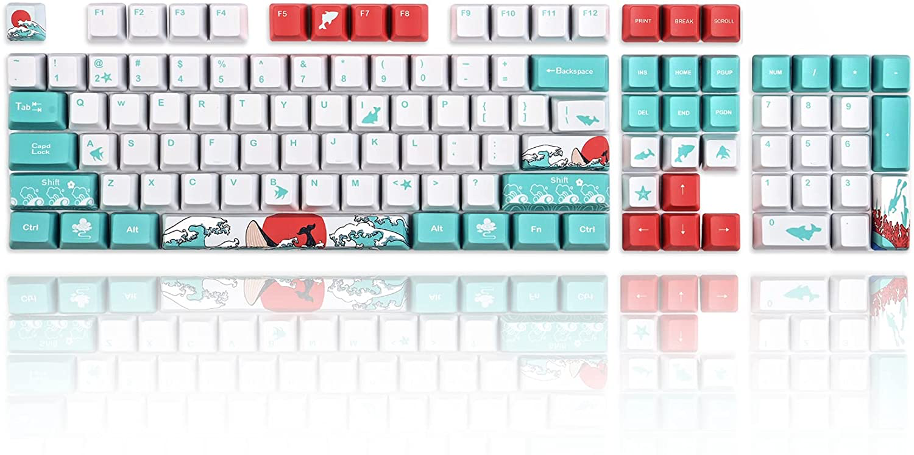

Pictured: 108 key keyset, via [Amazon](https://www.amazon.ca/Japanese-Keycaps-Percent-Mechanical-Keyboard/dp/B0936TN1JJ)

The above keyset will provide support for standard 60% (ex. Pok3r) ANSI (this means **not ISO**, this means **not European** usually) layouts, ANSI TKL’s, and ANSI full-size keyboards. However, what are you to do if you have a board you want to put keycaps on that even deviates slightly from this? You’ll be out of luck without the proper 1.75u right shift that you might need, or the 1u Control/Function/Alt keys that you need.

The real question that you’re asking is: “How do I know what I need?” For keyboards that have a less-common layout (i.e. not 6.25u spacebar 60%, TKL, or full-size), the reading below will attempt to explain what you need to look for to support your own board in diagrams of keysets.

#### Extensions To Look For

If you know your board layout, then you can see which individual keys you need so you can hunt for them in the kitting diagrams provided with every keyset. This chart is wholesale stolen from [the excellent KDD Info & How-To guide written by Buburoo](https://docs.google.com/document/d/1jjQghqjGP6BasZt4i0zTmK4p-gN_3IRhIAm2-CPE0kE/edit#).

Note: the piece on "different/additional shifts" denotes

- 2u shift support for GK64 and Womier K66/YC66 support
- 2.25u shift support for Leopold FC660-type layouts
- 1.75u shift support for most 65%, 75%, 96%/1800, and split right shift layouts

Now with this information known to you, you can probably start reading kitting renders for support like I have in this diagram below -

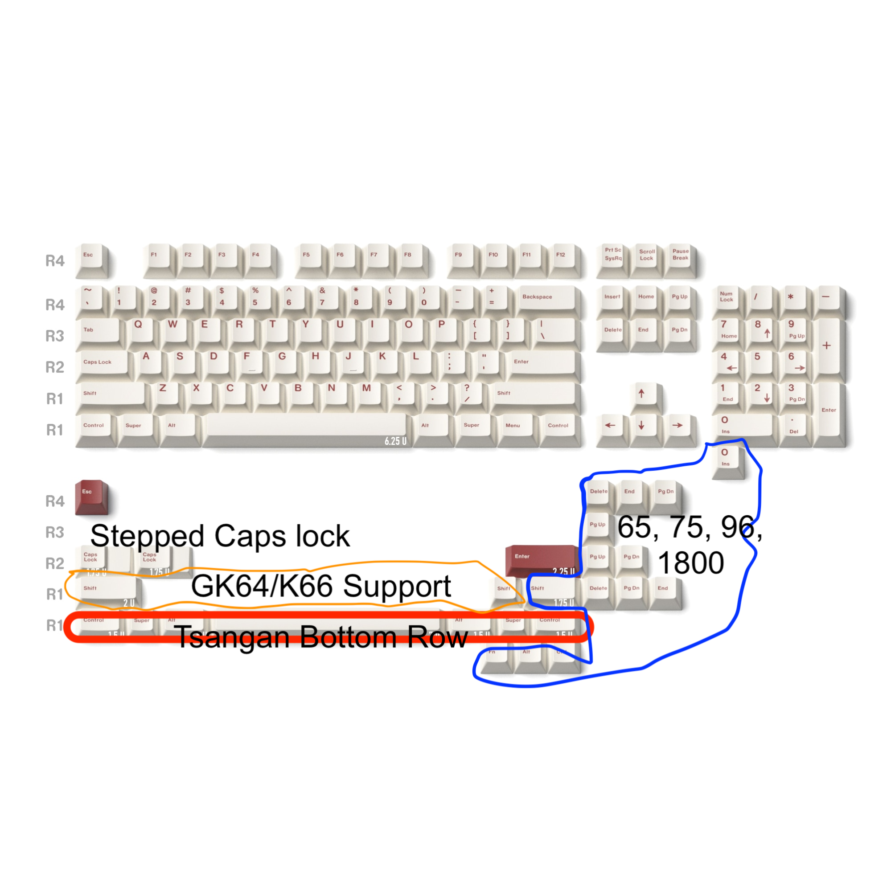

Pictured: JKDK RoW (Red-on-white), annotations by me

#### Example: A Well Kitted Keyset

Pictured: “Cherry Taro”, designed by pwade (via [Novelkeys](https://novelkeys.com/products/cherry-taro)), annotations by me

Here’s a good example of a base kit that provides very flexible kitting! You may not use all of it, but you’ll likely be able to use it on most/all of your boards, barring those with unpopular and esoteric layouts. You get

- Mod pipe and mod tilde (some prefer their look on 60’s)
- F13 key (nice for F13 TKL's or some exploded 75%'s)
- Stepped caps lock and 1.75u Control on R3 (nice to have for HHKB-style layouts)
- Physical ISO compatibility (ISO enter, R3 1u pipe, 1.25u left shift R4, and >< key beside left shift)
- Flexible 65%, 75%, and 1800/96% support
- Split backspace (R2 1.5u backspace, R1 pipe)
- Split bars (predominantly for Alice-layout spacebars support, may support other less-common layouts as well)
- 6u spacebar for stranger layouts
- Minivan (popular 40% layout) (R2 1.75u backspace, R3 1.25u Tab and 1.5u Enter)
- Extra shift keys
  - 2.25u right shift to support FC660M-style layouts
  - 2u shift to support GK64-like layouts with 2u left shift and arrows or Womier K66/YC66 2u right shift
  - 1u shift to support right shift on GK64-like layouts

### How To Find A Bad Keycap Set

#### Reading Reviews

Reading reviews from people who have actually purchased a keyset is more advisable than asking someone who has never bought the keyset you’re about to purchase. Reviews provide some context towards the quality of a product, and the high chance that users have submitted photos of what their keyset looks like on arrival. Don’t get caught by renderbait! Yes, a cell phone camera shot plus your gaming monitor probably won't reproduce accurate colors, blah blah blah, but come on, it's better than going off of the renders from a vendor.

#### Poor Legends Quality

##### Poor Printing

| Genuine GMK Darling                                                                                                                                     | PBT Darling Clone Example 1                         | PBT Darling Clone Example 2                              |
| ------------------------------------------------------------------------------------------------------------------------------------------------------- | --------------------------------------------------- | -------------------------------------------------------- |
| 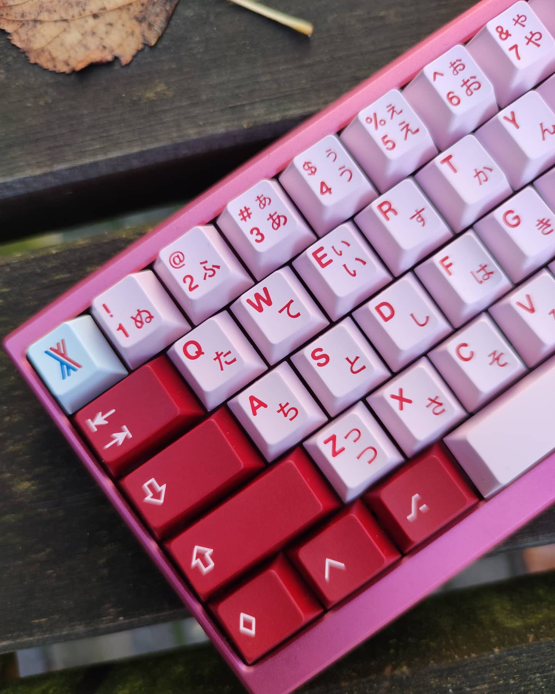                                                                                                                   |  | 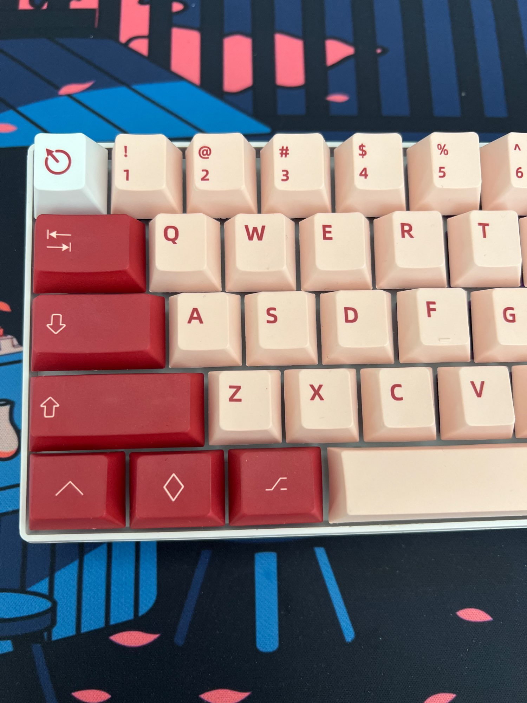      |
| via [MyKeyboard.eu](https://www.facebook.com/mykeyboard.eu/posts/gmk-darling-by-xerpocalypse-is-here-and-it-starts-shipping-out-today/2796713847241440) | Poor color matching and different legends font.     | Poor color matching, different font, missing sublegends. |

| [ePBT Dreamscape Render](https://geekhack.org/index.php?topic=113377.0) | HK Gaming Dreamscape                                                                                                                |
| ----------------------------------------------------------------------- | ----------------------------------------------------------------------------------------------------------------------------------- |
| 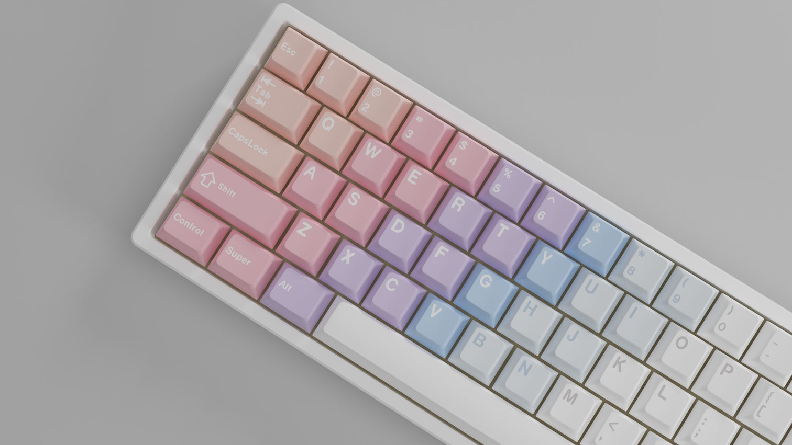                    | 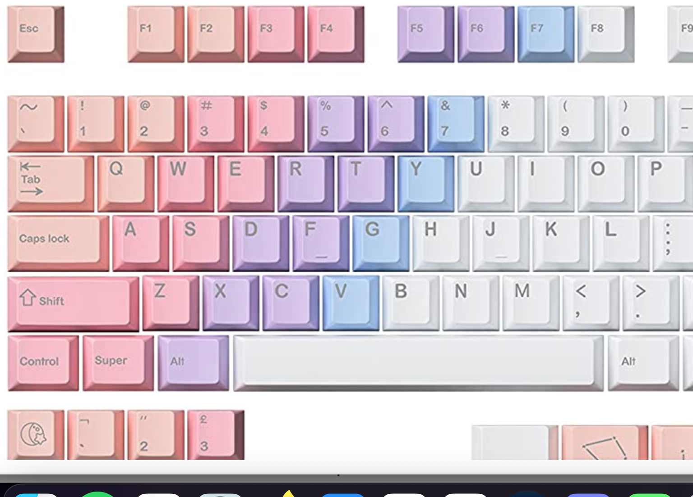                                                               |
| Designed by tsoiab10                                                    | Left side of the gradient does not have white legends like the original set, implying HK Gaming cannot/will not do reverse dye sub. |

##### Poor alignment

| JKDK BoW (black on white)                                                                | XMX Pseudo-Handarbeige                                           |
| ---------------------------------------------------------------------------------------- | ---------------------------------------------------------------- |
| 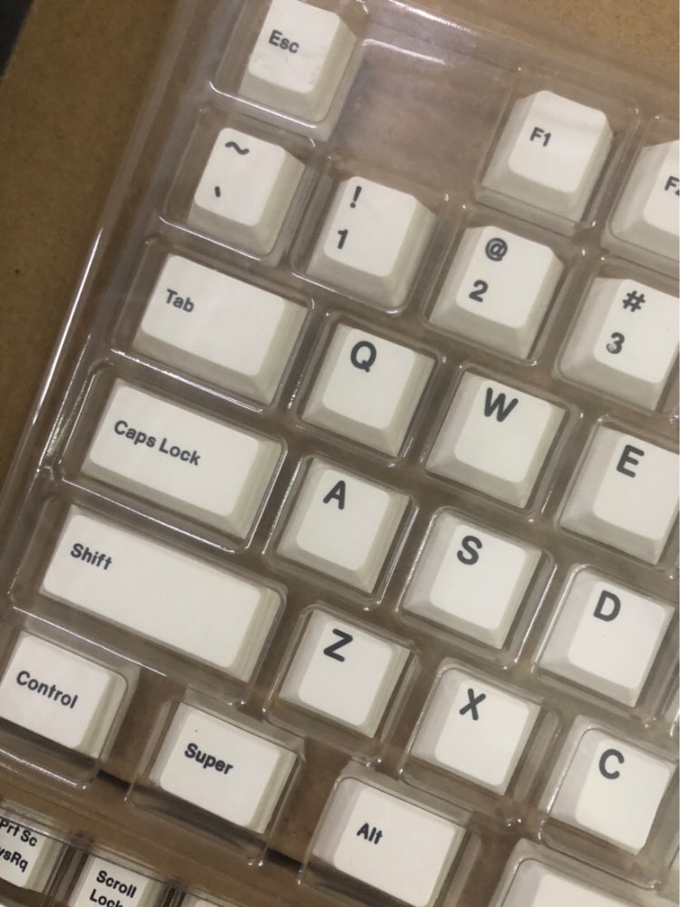 | 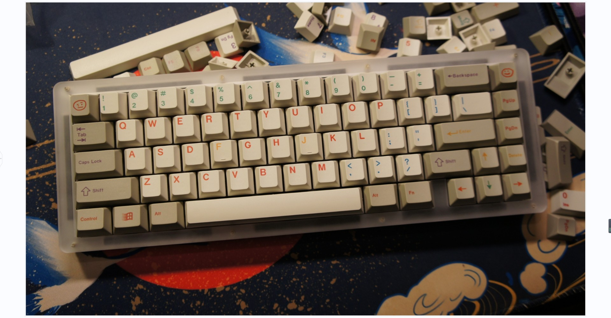 |
| via JKDK message to cardio (“That shift is flying away”)                                 | Sinking Tab and Pipe legend, short backslash legend vs pipe      |

##### Mold quality

| Winmix/Catcher Olivia clone, doubleshot PBT                                                                                                                                                         | "Shell Studio" "PBT Blush" (Doubleshot PBT Olivia clone)                                                                                                                                                       |
| --------------------------------------------------------------------------------------------------------------------------------------------------------------------------------------------------- | -------------------------------------------------------------------------------------------------------------------------------------------------------------------------------------------------------------- |
| 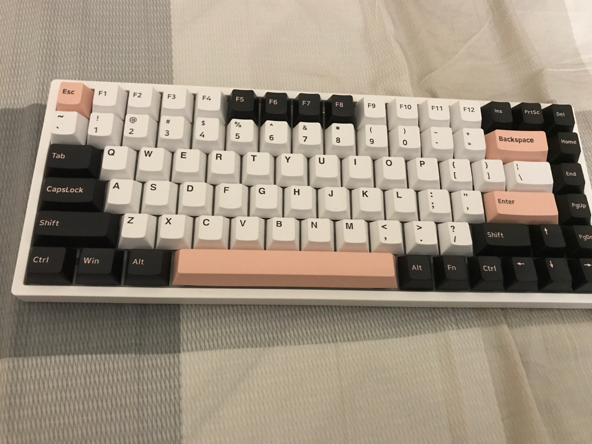                                                                                                                                 |                                                                                                                                          |
| via AliExpress reviews. Lack of icon legends on the modifier keys are a dead giveaway to this being a clone. I'm personally not a fan of the font used. Also, what’s the deal with “CapsLock”, man? | From [imgur album](https://imgur.com/a/CufPcmV) provided by /u/RatratanX from Reddit. Via their description, “You'll get what you paid for. Uneven thickness of legends. Still lucky no problems on mounting.” |

| Winmix OSA Doubleshot PBT                                                              | Aifei clone of GMK Jamon                                                        | Domikey Dolch (Cherry profile)                                                                                                   |
| -------------------------------------------------------------------------------------- | ------------------------------------------------------------------------------- | -------------------------------------------------------------------------------------------------------------------------------- |
| 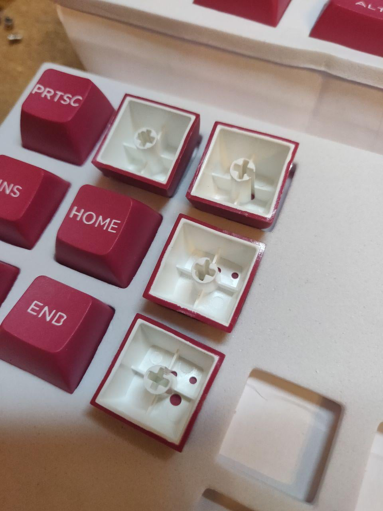                                        |                    | 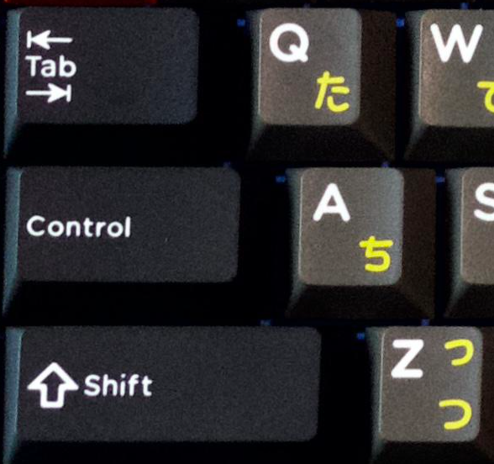                                                                      |
| via /u/denker88 on reddit. Legends are fine with the exception of one prominent issue. | via AliExpress review. Note the inconsistent letter sizes on the modifier keys. | Decent legend quality, but someone with a very fussy eye might make a stink about the spacing between the “F” and “T” in “Shift” |

#### Poor kitting/compatability

Please refer to [the kitting section](#on-kitting-or-how-to-read-a-kitting-diagram) for more detail, but a bad keyset is one that is going to omit support for boards you either have currently, or plan on having in the future.

#### Warped Bars

Early ePBT sets and Geekark R1 were known to have bars for stabilized keys that were significantly warped, and required intervention to un-warp them. These things have been solved, but some cheaper PBT sets with bars that don’t have rigidity ribs may warp as the injected plastic cools, and might require a dip in very hot water to soften it up enough for you to un-warp them. NOTE: DO NOT ATTEMPT THIS WITH ABS, YOU WILL MELT YOUR KEYCAPS.

#### Thickness

TODO: Fill this out

## Switches (The Switch Meta)

For personal switch recommendations, please refer to [the spreadsheet](https://docs.google.com/spreadsheets/d/e/2PACX-1vSWkz3vJflKwHt6aYwWWAULPU3NKbqfZj8J9h6IkcapPYVUbtxsaLXF9hnRmf-1aBAijMmBg0Jm6D7A/pubhtml) that milo and I have put together.

### Gateron

Base switches named after colors tend to match spring weight/actuation feeling of equivalent Cherry switches, except that their Clears are light linears instead of Cherry MX Clears, which are heavy tactiles. A lot of options with some winners and some stinkers.

- Their **Pro** series, offered in **Silver** (45g long spring), **Red** (55g spring), and **Yellow** (~63.5g spring), as well as in **KS-9** (PC top, Nylon bottom, SMD compatible) or Full **Milky** housings are known to be decent with their factory lube and stem retool to reduce wobble.
- Their **Cap** series of switches are known to be decent enough, and supposedly immune to "switch farts" if the pole/post are lubed.
- Full Milky Housing material switches are known to be a bit scratchier than their other offerings.
- Their Milk Top Black Bottom captures the slightly lower pitched topping out sound from the Milk Top while retaining a tolerable amount of smoothness from the nylon bottom. If you want a premium version of this, consider the Gateron X.

#### Inks

Popular among YouTubers for providing a low pitch sound, infamous among enthusiasts for a history of QC issues, between leaves falling out of the V1 housings, or certain batches of V2’s being significantly scratchy. Reports are mixed; the QC on these can be a crapshoot, and you can come out a winner, or risk the small possibility of coming out a loser. Still good switches, just somewhat risky.

#### Zeal

Gateron makes Zeal switches. The general gist on these is that they are not bad at what they are marketed for, but much cheaper alternatives that provide an experience of comparable quality exist. That said, I cannot discredit people whose preference is for Zeal switches, since they’ve heard the same schpiel about how they were wasting their money and blah blah blah blah; these people knew exactly what they were getting into when they dropped $1.10/switch (probably more for the silents, clickies, or UHMWPE mix things) on them.

### Durock/Everglide/JWK

Starting off by [selling fake Tealios with Gateron top housing molds](https://www.theremingoat.com/blog/t1s?rq=t1), JWK produces some of the smoothest linears available on the market, and a respectable range of tactile options. Famous for producing the budget switch commonly referred to as “JWICK”s, and infamous for producing recolors of their base linear or tactile frequently for vendors who understand how much people like to color-coordinate their switches with the rest of their board. Their major flaw is that their tops tend to lend a particular “thin” topping out sound, and some enthusiasts mitigate against this by replacing the tops with nylon tops from Cherry MX switches.

#### Everglide Aqua King/Water King

Tolerance issues and overapplication of thick factory lube prevented earlier revisions from having consistent stem return. After degreasing them and re-applying thinner lube these things turn out alright, but that is much more work than you deserve to put into a jank switch. Consider Tecsee Ice Candies/Snow Globes or get over not having RGB shine completely through your switch.

### Outemu

Outemu switches have a bad rap for prominent leaf ping on occasion, and the fact that their switches appear in the cheapest of boards (Tecware, Redragon, etc.) does little to help their reputation. If you can lube the leaf and spring, you can get some bargain basement cheap switches that are pretty decent.

#### Gazzew x Outemu “Boba” Switches

These are good, you don’t need to ask. Leaf ping solved. Smooth stock. Bottoms and non-clear tops use some mystery material (generally referred to as “boba housing” or something like that) Housings are extremely tight, to the point where hard films (polycarbonate), or any films for that matter, are not recommended, and not recommended to be used for franken-switching with non-Outemu stems. Can’t really go wrong with these otherwise. Slightly hard to source, but not impossible if you’re willing to shop at MKZealots on AliExpress. Check gazzew.com for vendor listings.

### Tecsee

Purportedly affiliated with BSUN (YOK Panda manufacturer) in the past, Tecsee makes interesting switches with tight housings that are occasionally plagued by one inscrutable issue or another. The sound of their nylon housings are pretty nice. Leaves (especially on their tactiles, like Salmons, Neapolitans, Glorious Pandas, etc.) are prone to some small amount of leaf ping across the board (just lube the side of the leaf, you’ll be fine).

#### PME Housings

New plastic used exclusively by Tecsee. Fairly low in pitch. Nothing wrong with it as a material, but it is prone to flaking - no reports have claimed that it disrupts switch functionality, but to prevent you from freaking out, this is something you should know before you purchase something like Purple Pandas, Carrots, Giant v5’s, or Kingfishers.

#### UHMWPE/PE Mix materials

Diamond tops fly off a little bit too easily. Lychee and Ruby/Sapphire stems (UHMWPE mix) shrink too much, and are subject to prominent amounts of stem wobble. The PE mix used in Naevy, Raed, and Snag switches is prone to creating a brittle product that has had occasional reports of it snapping off into keycaps.

### Cherry

Cherry is a good case study in how injection plastic molds do wear out over time - we see cycles of Cherry retooling their switch molds, leading them to become significantly smoother than previous batches, then newly produced switches gradually becoming scratchier and scratchier until they’re back to meeting their reputation as a manufacturer of scratchy switches.

#### Hyperglide

Late 2020 retool that applied to Reds, Browns, and Blacks. Early batches were reported to be unexpectedly smooth (for Cherry). Later batches to date are starting to get scratchy again. The plate mount (3 pin) housings felt scratchier than the PCB mount (5 pin) between two batches purchased between DangKeebs and Divinikey around September-October 2021.

#### Non-Hyperglide “Retool”

Retool that occurred sometime around 2017 for most switches except for Clears. Again, smooth at first, but the longer time went on and the molds were used, the scratchier the housings produced became.

### TTC

Popular in China, less popular in the West. Known to be smooth, pretty cheap. Can’t go wrong with these!

### Kailh

A big manufacturer that produces all sorts of sensor equipment, not just limited to MX switch clones. Not awful, just less popular in the switch meta currently for not generating anything particularly interesting, although they do have some funky options. Generally, their switches are of "winglatch" style, which requires an opener different from your regular 4-pin opener, or a flathead.

#### Full POM Housing (Creams, Blueberries, etc.)

Infamous for being scratchy as all hell. Claims about POM being a self-lubricating plastic are marketing miscommunications of the material’s science. Someone’s going to tell you that you can “break these in” and they’re “good after they’re broken in”, but it’s not worth it. These have been used to make frankenswitches made popular by YouTube videos, but you can use other Kailh linear stems as stand-ins for these. Otherwise, it's probably better to avoid them in lieu of some other POM housing switch, such as a Durock POM, or Infinitykey Cow.

#### Box Tactile

A flaw in the design of how Kailh Box switches generate a tactile event means that after the lube has worn off between the stem leg and leaf, a small click sound can be heard from these switches when pressed, per [this Geekhack thread](https://geekhack.org/index.php?topic=96672.0).

#### Cream stem stand-ins

Kailh stems tend to run on the longer side, meaning when they are swapped into other housings, they tend to bottom out on the pole and not the slider - this is a feature non-unique to Novelkeys Cream stems. Linear stems like those from Kailh Blacks, Kailh Pro Burgundies, and/or Kailh Reds should effectively be identical, barring the Cream stems having been exposed to a retool that the other linear switchs have not been (cannot confirm, ymmv).

### KTT

Manufactures Akko CS line of switches, as well as Akko Jelly (probably)/Akko CS/Akko Jelly. Smooth linears with fairly light (generally 62g and below) springs at cheap prices. Tactiles are decent. A lot of spring variants for their linears. They’re good switches, you’re fine..

## Switch openers

A Cherry-style switch opener does not open winglatch housings, and a winglatch style opener does not open up Cherry-style switch tops.

| Opener                                                                                                                            | Winglatch top housing                                                     | 4 pin top example                         |
| --------------------------------------------------------------------------------------------------------------------------------- | ------------------------------------------------------------------------- | ----------------------------------------- |
|                                                                | 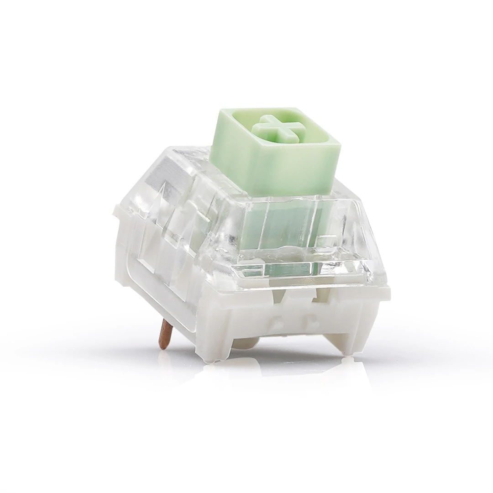                              | 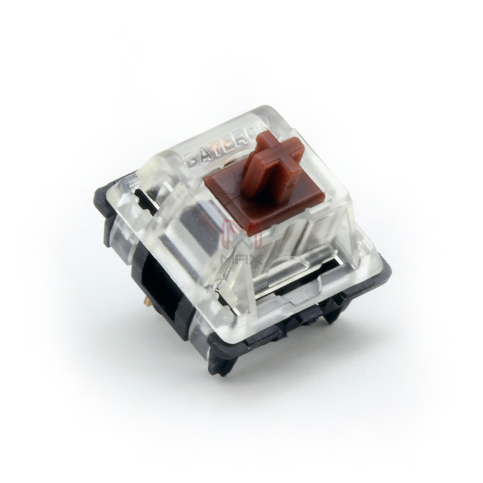 |
| Winglatch opener on left, 4 pin on right. (via [KBDFans](https://kbdfans.com/products/gb-2-in-1-machined-aluminum-switch-opener)) | Kailh, Outemu, and KTT produce many switches with winglatch top housings. |                                           |

## Stabilizers

Please verify which type of stabilizer you need for your board; very few take PCB mount and Plate mount stabilizers simultaneously, so you can just assume that only one works and you either need to buy one or the other. The housings have very visible differences so you can’t really get them mixed up -

(image borrowed from [monstargears](https://www.monstargears.com/98/?idx=172))

**You must mod the stabilizers to make them good.**

As with all cases, it is important that you attempt to wire-balance (YouTube guides will be sufficient on this) and provide lube for your stabilizer wire before you start considering other means to reduce rattle and tick, such as “holee mod”, “epsi mod”, “plumbers mod”, “tailors mod”, the “Keynions/Korean stab mod”, and so on. Issey83 has also provided video tutorials on stabilizer assembly that you should watch and re-watch should you have issue with stabilizer assembly and installation that are provided in the pins in #kb-help.

### PCB Mount Stabilizers

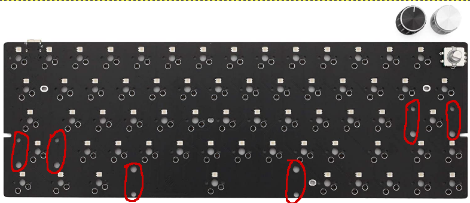

Pictured: a KPRepublic BM60EC PCB - note how there are two holes on each side of the socket for a stabilized key - this is where the housing for a PCB mount stabilizer fits in

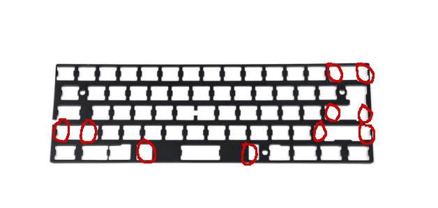

Pictured: A “universal” 60% plate for a tray mount keyboard - notice the lack of specific and clear cutouts for stabilizers around stabilized keys like the shift, enter backspace, or space?

#### Recommended

- Durock V2
  - The community standard for a solid stabilizer. Still requires a bit of balancing and lube. A bit expensive for the money.
- Zeal Stabilizers
  - By god they’re expensive, but Snckler talks a big game about these, and how the tolerances are better than Durock stabs.
- C3/Equalz Stabilizers
  - Wires require ape strength to balance, but otherwise I have no complaints. The foam strips included in the V3 package do provide some community options to reduce rattle
- Cherry Clip ins
  - Have not borked by retool (yet). As solid as any other stabilizer when wire balanced and lubed with a thick enough grease. If they’re not being flipped, they’re cheap as all hell. Stocked by keebio, 3DKeebs, and Mouser if you’re based in the US.
- TX Stabilizers
  - This is the big idea improvement in stabilizers the hobby has been waiting years for - line the inside of the stabilizer stem with a TPU insert to dampen wire ticking. Real good stock. 2u’s practically don’t require lube. Also hard as hell to find, and infrequently and inconsistently stocked between vendors. Sold by TX on TaoBao, Ashkeebs in CA has been known to sell them, as well as Mekibo and ThocKeys in the US. Check their social media/mailing list to see if any of these places will stock them soon before begging for a date when they’ll restock.

#### Not Recommended

- Durock V1/Whatever Everglide Thing Is Just A Recolor Of These
  - A lack of robust wire retention clip means the wire pops out on these much too easily when placing or removing a keycap - this is awful to deal with, especially if the wire pops after you’ve soldered your board together,  which means you’ll have you desolder the board or try to finnick with the wires to get them back in.
- Cherry/GMK Screw-Ins
  - Per invis, a relatively recent retool ruined the tolerances of these, making them not very good. Beware!
- Glorious GOAT Stabilizers
  - The ones that arrive stock with the GMMK Pro, overdone lube job making them a bit sticky at first. You’ve likely heard all the jokes about them by now. Re-tune them, or replace with any of the recommended screw-ins.
- No-name “OEM” Stabilizer
  - One time my stab stems were too tight against my caps and when I tried to remove my shift cap, the clipins undid themselves, and the stems came out with the cap and blasted out of the housings. I decided to get Durocks at that point. I am still bitter.

#### Be aware of issues

- Staebies
  - Manufactured by Tecsee. Designed only for GMK molds, so key caps with molds that vary from GMK tolerances (such as some PBT keycaps) may bind, as secondhand reports have claimed. Occasional reports of these stems cracking keycap stems have been spotted in the wild. Other users have a grand time with these, and the stock rattle on the spacebar outclasses TX stabs.

### Plate Mount

If your plate takes plate mount stabilizers, it will be very obvious from the appearance of the plate that there are cutouts that match the shape of a plate mount stabilizer housing:

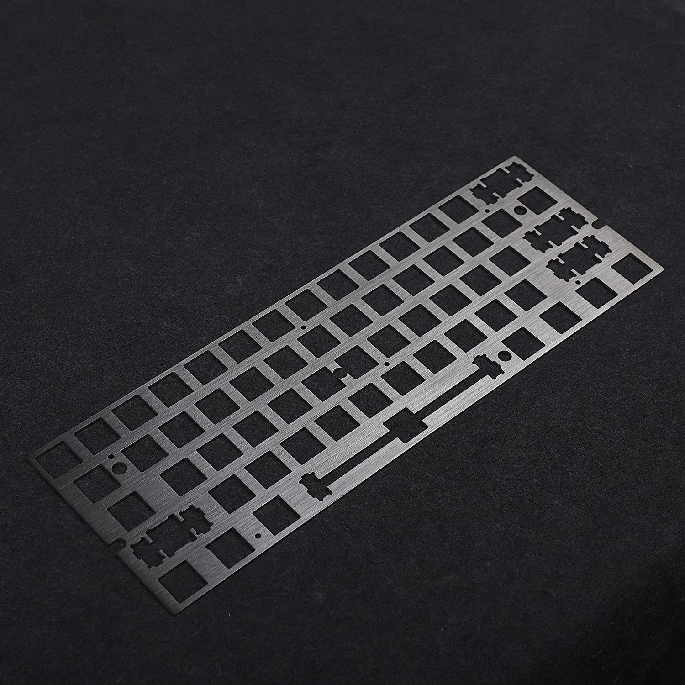

Pictured: A plate with specific cutouts for plate-mount stabilizers to fit into the plate. Also note that the hole to fit the wire through that extends from one stabilizer housing cutout to the other.

Folk knowledge suggests that plate mount stabilizers aren’t “as good” as PCB mount stabilizers, but these can still sound perfectly fine if you’re willing to ignore some hater in your ear.

- Recommended
  - Durock Plate Mount/Everglide Plate Mount
    - Decent for plate mounts in my experience with the all-black ones.
  - Gateron Plate Mount
    - Not god-awful for my experience. The claim of “factory lube” is somewhat wishful thinking, just re-do this on your own.

## Lubricants

Lubricant recommendations are a soft science leaning towards parroting old wives’ tales than  hard reproducibility. Here, I parrot old wives tales, but try to provide some justification for them.

### A quick reference

|                 | Krytox 105-107 | 3203 | 3204 | 205g0         | XHT BDZ | Dielectric Grease | China Grease  | Superlube5 |
| --------------- | -------------- | ---- | ---- | ------------- | ------- | ----------------- | ------------- | --------------------- |
| Spring          | ✓              | ✓    | ✓    | ✓             | X       | X                 | !4 | 51004                 |
| Housing         | ✓1  | ✓    | ✓    | ✓             | X       | X                 | !4 | 51004                 |
| Stem            | ✓1  | ✓    | ✓    | ✓2 | X       | X                 | !4 | 51004                 |
| Stabilizer Wire | X              | X    | X    | ✓3 | ✓       | ✓                 | ✓4 | NLGI G0-G2            |

1: PTFE oils do not provide the same smoothing to housings as greases do, but are still good for when users want to be more conservative/less drastic with their lubrication.  
2: Grease at this viscosity is known to dull/smoothen/reduce the intensity of the bump on tactile stems. Avoid unless you intend on reducing the bump.  
3: It can be argued that 205g0 is too thin for stabilizer wires, and will migrate soon with continuous usage. Still, this is a preference thing.  
4: Products marketed as "GPL 105/205g0" without being manufactured by Chemours/Dupont/Miller Stephenson are likely manufactured with less reputable grease formulations. These tend to separate (between grease and oil) faster than genuine Krytox/Tribosys products without good binders.  This is generally what you get if you've refused to buy lube off of anywhere but Amazon, and didn't end up buying 205g2. If you know what you're getting into, and can accept these products for what they are, more power to you.  
5: 51004 and 51030 are known good oils. For stabilizer wire, some silicone grease PTFE that's NLGI Grade 0 to Grade 2 (such as 92003) should be great.

### Housing And Stem For Switch And Stabilizer

We recommend greases/oils that contain Teflon (PTFE/polytetrafluoroethylene) content for high-quality lubrication that is not not prone to separating quickly when left at rest.

- Recommended
  - Industrial greases developed by Miller Stephenson/Dupont/Chemours
    - Tribosys 3203 is a stand-in for 203g0, 3204 is a stand-in for 204g0, and Krytox GPL 205g0 are the commonly recommended greases to lightly paint your switch friction points with.
  - Oils from the same manufacturer
    - Prior to using grease to lube Ergo Clears to ensure that they didn’t have return issues, oils were a popular option to reduce friction in a switch. Krytox 105 (thinner) to 107 (a bit more viscous) will fill that need while minimizing the risk that you over-lube.
  - Superlube
    - Per xalmart, 51004's a good Superlube oil for these applications.
  - Not Recommended
    - AliExpress or Amazon mystery grease
      - If you’re buying lube off Taobao or AliExpress, the odds that its genuine Krytox from Miller Stephenson/Chemours/Dupont are infinitesimal. Notice how there’s no mention of Krytox, or if it is, it's pixelated out in the product image for some reason? You’re getting a product that is similar in consistency to what will work good as a switch grease, but lacks the proper chemical binders to prevent the oils from separating from the grease as quickly. There’s a reason we recommend vendors on MechMap: we trust them to sell products with the proper formulation that prevents their components from separating. We are not interested in scooping finders fees when you end up buying some Miller Stephenson product - we do this to ensure you don’t have to deal with a substandard product when you don’t know what substandard means yet.
    - Krytox GPL 205g2
      - If you’re here, maybe you were stubborn and refused to shop anywhere outside of Amazon if you’re asking about this. Maybe you have a gift card, maybe you’re using your parents credit card and they don’t trust it to be used on someone who named their shop after a bad pun on some keyboard thing. Grade 0 is thick enough for switches. Grade 1 is too thick most of the time, and Grade 2 is way too thick to be used without being thinned, and if anyone says that you do it because they’ve used it before, they’re just using you as a surface to stroke their own ego. Don’t get this, just get some Grade 0 lube.
    - Petroleum-based lubricants (WD40, vaseline, etc.)
      - Petroleum based lubricants melt plastics slowly. You would be better served leaving them stock than letting them melt over time.
    - Most spray lube (WD40, Superlube 31110)
      - Just run !spraylubing in MechKeys.
      - I say “most” due to the possibility of Tribosys KSL becoming available in the future, which has been formulated to not gunk up the connection of the contact leaves.
  - Hesitant Recommendation
    - Glorious G-Lube
      - Less than ideal, but it may be your only option. At least you know what you're getting into.
      - [SDS](https://cdn.discordapp.com/attachments/481804810497163264/768374046505041950/G-Lube_MSDS.pdf) for those interested
      - No PTFE content confirmed. A great description is provided by u/marks_ [here](https://www.reddit.com/r/MechanicalKeyboards/comments/jfbzqx/a_chemical_breakdown_of_glorious_lube_glube/)
    - Whatever grease you found on AliExpress or Amazon
      - The difference between SW92SA and Mystery Manufacturer “GPL 205g0” is that I already know that SW92SA is jank and going to separate, while if I buy GPL 205g0, I run the risk of deluding myself into believing that I have the hookup while everyone buying genuine Krytox from a traditional vendor is getting scammed. If you know you’re getting a grease that’s going to separate, then more power to you.
  
### Switch Spring

The purpose of lubing a switch spring is to provide goop that dampens the vibration a spring may experience during a strong upstroke movement that leads to what you may recognize as “spring ping”.

- Recommended
  - Traditional industrial greases like GPL 205g0, 3204/204g0, 3203/203g0 can be painted on the spring, or donut dipped.
  - Thinner oils like Krytox GPL 105, 106, 107 are fine for bag lubing.
  - Gazzew’s Blend #7 also works great for donut dipping. If you buy parts from him, he might throw this in if you spend enough. It’s real thick stuff, so its best for springs really.
  - Rainkeebs recommended gun oil. I trust rain.
  - Superlube oil like 51004
- Not Recommended
  - Dielectric grease
  - Petroleum-based lubricants
    - Your plastics will melt. I explained this earlier.

### Stabilizer Wire Lubricant

You no longer require PTFE content for applications to the wire to prevent wire ticking. Dielectric grease, silicone grease, lithium grease, all those will get the job done as well.

- Recommended
  - GPL 205g0 (Does not have to be Krytox)
    - Yeah, mystery grease will work here, just let the oil separate first so it doesn’t turn into a mess on your PCB later.
    - As thick as this is, you can (and probably should) go thicker on the stabilizer wire, which needs a more viscous material to prevent wire tick.
  - Gazzew Blend #7 (recommend for donut dipping springs and and stabilizer wires. Don’t ask if you should get this, it’s not a must-have, just use some other lube)
  - XHT-BDZ
    - A relatively new product, and prices will vary harder.. This is as thick as toothpaste, maybe thicker than Blend #7; the spec sheet says it's about Grade 1.5. Apply this conservatively, as applying a liberal amount may lead your stabilized keys to feel slightly sluggish on press. When used properly, this is pretty good.
  - Dielectric grease
    - You don’t need a specific brand. You do not need a specific brand. Permatex is pretty popular in North America, but your region may vary. It doesn’t need to be very specific because you just need some goop that’s thick enough to stop the wire from rattling all over the place.
  - Superlube
    - NLGI Grade 0 to Grade 2 will get the job done.
- Not recommended
  - Grease thinner than 205g0
    - This grease will migrate (read: be pushed around by the movement of the wire) around until there is little left to dampen the wire tick.
  - PTFE oils like GPL 105-107
    - I shouldn’t have to put this here, but if a history of help channel activity has taught me anything, some people need to be reminded that making a stabilizer wire oily will not stop it from slapping against the interior of a stabilizer stem.
  - Petroleum based lubricants

## Films

Yeah man, they’re all good. There aren’t really good films or bad films, as they’ll all do the same job of making a top housing fit onto a bottom housing tighter. Just make sure you put them in the correct orientation.

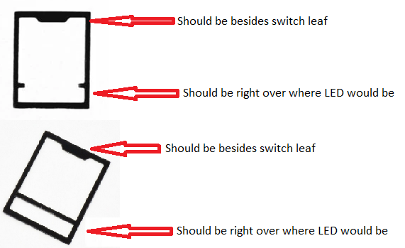

Be sure to understand the material that the films you choose are made out of, and how your switches may react to them.
If you feel your switch develop an unexpected tactile bump, this may be the stem hitting against a part of the film poking into the housing well. Disassemble and replace film if/when this happens.

### Materials

- Soft
  - Foam (MDI, Deskeys)
    - Soft and very compressible. Generally will fit most switches, even in cases where they genuinely are too tight for most films. Fairly annoying to put on, due to the film bending so easily.
    - Generally 0.3mm thick - this is a normal thickness, and will compress down.
- Medium
  - HTV
    - More papery than polycarbonate, more flexible, but not really compressible like MDI foam/Deskeys film material/Silicone.
    - Around 0.15mm thick.
- Hard
  - Polycarbonate
    - These films are made of hard polycarbonate. They will not compress.
    - 0.125mm - 0.15mm thick. Buy 0.125mm thick if your housings feel like they don’t suffer from too much wobble, or 0.15mm thick if you’re sure that there’s a bit of housing wobble.
  
### Switches that Films Don’t Work Good in

#### Winglatch Housings

| Kailh Box Jade (Winglatch top housing)                                                            | Gateron Brown (non-winglatch top housing)                                                                            |
| ------------------------------------------------------------------------------------------------- | -------------------------------------------------------------------------------------------------------------------- |
|                                                       |                                                                        |
| “Winglatch” housing (via kbdfans). The top housing is secured two large "wings", one on each side | “Cherry style”/”4 pin” top housing. Note the two "pins"/legs of each side the top housing, securing it to the bottom |

Winglatch housings are generally “tight enough” (reduced wobble in W-E direction) that films are not needed to prevent housing wobble, and cause difficulty in re-assembling the switch. These generally tend to get produced by Kailh for all their switches that aren’t Cream variants (Launch Creams, Blueberries, Cream Tactiles, etc.) non-Boba Outemu switches, most KTT stuff (and consequently most Akko CS stuff), but you should know these when you see these.

#### Misc. Cases

These following switches are known to have fairly tight housings, and will not react well to films of medium or hard material (soft films may compress down enough that they still may be able to close together

- Outemu x Gazzew “Boba” variants (this includes those with PC/clear tops)
- Kailh x Novelkeys Cream variants
- “Panda” housings
  - [The proliferation of housings made with the Panda name](https://www.theremingoat.com/blog/the-pandaverse) has kinda diluted the meaning, but thanks to the fact that most of these variants (Purple Pandas, Frost Pandas, Ethereal Pandas, Glorious Pandas) are produced by Tecsee, you can safely assume that the molds provide similarly tight tolerances. Pandas are known to have tight housings.
