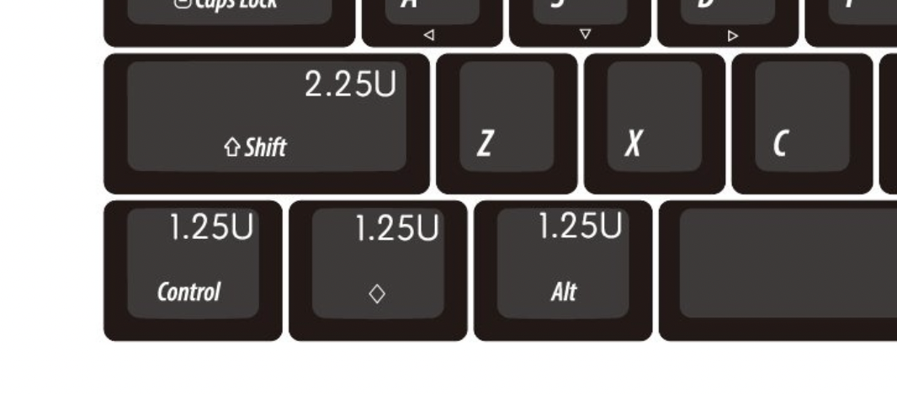

# Stabilizers

This guide is limited to providing guidance for Cherry-style stabilizers. Guidance on Costar, Alps, and Topre stabilizers is not provided.

- [Stabilizers](#stabilizers)
  - [PCB Mount Stabilizers](#pcb-mount-stabilizers)
    - [Recommended](#recommended)
    - [Not Recommended](#not-recommended)
    - [Be aware of issues](#be-aware-of-issues)
  - [Plate Mount](#plate-mount)
  - [Lengths](#lengths)
    - [6.25u](#625u)
    - [7u (Tsangan or WKL)](#7u-tsangan-or-wkl)
    - [Other](#other)

Please verify which type of stabilizer you need for your board; very few take PCB mount and Plate mount stabilizers simultaneously, so you can just assume that only one works and you either need to buy one or the other. The housings have very visible differences so you can’t really get them mixed up -

(image borrowed from [monstargears](https://www.monstargears.com/98/?idx=172))

**You must mod the stabilizers to make them good.**

As with all cases, it is important that you attempt to wire-balance (YouTube guides will be sufficient on this) and provide lube for your stabilizer wire before you start considering other means to reduce rattle and tick, such as “holee mod”, “epsi mod”, “plumbers mod”, “tailors mod”, the “Keynions/Korean stab mod”, and so on.

Issey83 has provided video tutorials pinned within #kb-help on stabilizer assembly that you should watch and re-watch should you encounter issues. Also helpful are the [MachineAbuse#1442 visual guides to stabilizer assembly](https://imgur.com/gallery/pHK0vhz) you can consult with.

## PCB Mount Stabilizers

Pictured: a KPRepublic BM60EC PCB - note how there are two holes on each side of the socket for a stabilized key - this is where the housing for a PCB mount stabilizer fits in

Pictured: A “universal” 60% plate for a tray mount keyboard - notice the lack of specific and clear cutouts for stabilizers around stabilized keys like the shift, enter backspace, or space?

### Recommended

- Durock V2
  - The community standard for a solid stabilizer. Their main improvement over the V1 is the reversal of the wire holders that makes stab wire popout a thing of the past and close to impossible, I'm sure someone will still find a way.  They still require a bit of balancing and lube and are a bit expensive for the money. Everglide V2s are basically the same thing, just different colors.
- Zeal Stabilizers
  - By god they’re expensive, but Snckler talks a big game about these, and how the tolerances are better than Durock stabs. You can probably get away with just lubing them.
- C3/Equalz Stabilizers
  - Wires require ape strength to balance, but otherwise I have no complaints. Their standout feature is the tight wire hold that reduces the chance of stab wire popout while in your board. The foam strips included in the V3 package do provide some community options to reduce rattle. Keep in mind that bandaid or foam stickers like those included with C3 stabs are most effective on thinner PCBs and not 100% necessary on thicker PCBs. Very good stabs.
- Cherry Clip ins
  - Have not borked by retool (yet). As solid as any other stabilizer when wire balanced and lubed with a thick enough grease. If they’re not being flipped, they’re cheap as all hell. The 2U's are usually marked as G99-0742 if you're ordering from a wholesaler like Mouser. Don't forget to clip the extra legs on the stem bottom to make it flat. Chicken's favorite. 
- TX Stabilizers
  - This is the big idea improvement in stabilizers the hobby has been waiting years for - line the inside of the stabilizer stem with a TPU insert to dampen wire ticking. Real good stock. 2u’s practically don’t require lube. Also hard as hell to find, and infrequently and inconsistently stocked between vendors. Sold by TX on TaoBao, Ashkeebs in CA has been known to sell them, as well as Mekibo and ThocKeys in the US. Check their social media/mailing list to see if any of these places will stock them soon before begging for a date when they’ll restock.
  - Note: if you're having issues with the wire binding against the housing/feeling too tight on reassembly, try and install the the other end of the wire in the housing where you feel tightness.
- Gateron Stabilizers
  - Ink stabs are mega expensive, but the other ones seem to be good enough. The Black/Silver model seems to be designed to be used specifically with switches that feature early bottom out (generally pole bottom out/speed switches)
- Owlabs Stabilizers
  - Rain says these are good enough. Wires marketed as "liquid metal", whatever that means. The wires will not bend easily, some times bleh.
- Wuque Stabilizers

### Not Recommended

- Durock V1/Whatever Everglide Thing Is Just A Recolor Of These
  - A lack of robust wire retention clip means the wire pops out on these much too easily when placing or removing a keycap - this is awful to deal with, especially if the wire pops after you’ve soldered your board together,  which means you’ll have you desolder the board or try to finnick with the wires to get them back in.
- Cherry/GMK Screw-Ins
  - Per invis, a relatively recent retool ruined the tolerances of these, making them not very good. Beware!
- Glorious GOAT Stabilizers
  - The ones that arrive stock with the GMMK Pro, overdone lube job making them a bit sticky at first. You’ve likely heard all the jokes about them by now. Re-tune them, or replace with any of the recommended screw-ins.
- No-name “OEM” Stabilizer
  - One time my stab stems were too tight against my caps and when I tried to remove my shift cap, the clipins undid themselves, and the stems came out with the cap and blasted out of the housings. I decided to get Durocks at that point. I am still bitter.

### Be aware of issues

- Staebies
  - Manufactured by Tecsee. Designed only for GMK molds, so key caps with molds that vary from GMK tolerances (such as some PBT keycaps) may bind, as secondhand reports have claimed. Occasional reports of these stems cracking keycap stems have been spotted in the wild. Other users have a grand time with these, and the stock rattle on the spacebar outclasses TX stabs.

## Plate Mount

If your plate takes plate mount stabilizers, it will be very obvious from the appearance of the plate that there are cutouts that match the shape of a plate mount stabilizer housing:

Pictured: A plate with specific cutouts for plate-mount stabilizers to fit into the plate. Also note that the hole to fit the wire through that extends from one stabilizer housing cutout to the other.

Folk knowledge suggests that plate mount stabilizers aren’t “as good” as PCB mount stabilizers, but these can still sound perfectly fine if you’re willing to ignore some hater in your ear.

- Recommended
  - Durock Plate Mount/Everglide Plate Mount
    - Decent for plate mounts in my experience with the all-black ones.
  - Gateron Plate Mount
    - Not god-awful for my experience. The claim of “factory lube” is somewhat wishful thinking, just re-do this on your own.

## Lengths

There are some oddball corner cases to this that I'm too lazy and uninformed to figure out and document.

| Key width        | Stabilizer Width |
| ---------------- | ---------------- |
| 2u, 2.25u, 2.75u | 2u               |
| 3u               | 3u               |
| 6u               | 6u               |
| 6.25u            | 6.25u            |
| 7u               | 7u               |

3u and 6u are already exotic enough. On boards with non-exotic layouts without split backspace (60%, 65%, 75%, TKL, 1800/96%, full-size) enter keys, backspace, ANSI left shift and non-split right shift will use a 2u stabilizer.

For most beginner boards with their first kit, figuring out if your spacebar takes a 6.25u or 7u stabilizer wire generally boils down to to checking the sizing of the 3 keys left of the spacebar. For **most** cases (I say **most** due to some edge case exceptions, which, if you're reading this guide, will be above the pay grade of whatever kit you get), rule of thumb is as follows:

### 6.25u

If the three keys left of the spacebar are equal in size and only slightly wider than an alphanum key, then you want a 6.25u spacebar stabilizer.
**For most beginner kits, especially those that take hotswap, this is generally the default.**

| Example 1                            | Example 2                              |
| ------------------------------------ | -------------------------------------- |
|  |  |
| via mechanicalkeyboards.com          | via kbdfans.com                        |

Leopold FC660M has 1.25u/1u/1.25u arrangement, but the spacebar is also 6.25u. 6.25u also goes with "china blocker"/"china WKL"/"little tooth" boards (if you own one of these, you will assuredly know that it is that).

### 7u (Tsangan or WKL)

If the three keys left of the spacebar have two keys that are much wider than the other (in a 1.5u, 1u, 1.5u arrangement), then you want a 7u stabilizer. If there is a blocker that is the width of a 1u key, then you also probably want a 7u stabilizer.

| [Tsangan Layout, via sn00zzze](https://imgur.com/gallery/u4AlCis) | WKL NCR80 [via u/15buckslilman](https://redd.it/stafu8) |
| ----------------------------------------------------------------- | ------------------------------------------------------- |
|                          |        |

### Other

Generally, the presence of 1.5u modifier keys on the bottom row implies a non-6.25u spacebar, which for most kits will result in a 7u. Some weird arrangements like Realforce 87u style (1.5u/1u/1.5u/spacebar/1.5u/1u/1u/1.5u) imply a 6u spacebar, Filco Minila takes a 3u spacebar, and so on. If you can do math, then take the width of the row above the spacebar row (usually 15u for 60%'s and TKL's) and subtract the width of all the other modifier keys to get the spacebar width. If you've bought a kit, consult the KLE (presumably some link or screenshot from keyboard-layout-editor), or the product description page.