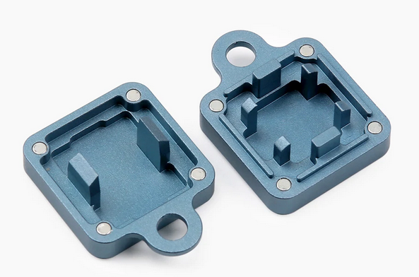
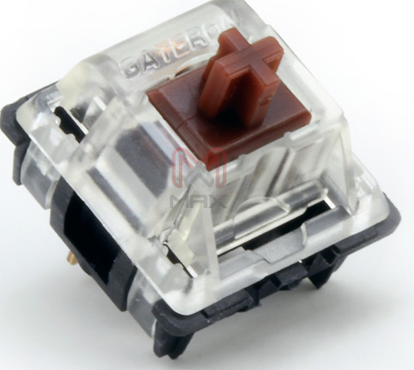

# Switch openers

A Cherry-style switch opener does not open winglatch housings, and a winglatch style opener does not open up Cherry-style switch tops.

| Opener                                                                                                                            | Winglatch top housing                                                     | 4 pin top example                         |
| --------------------------------------------------------------------------------------------------------------------------------- | ------------------------------------------------------------------------- | ----------------------------------------- |
|                                                                |                               |  |
| Winglatch opener on left, 4 pin on right. (via [KBDFans](https://kbdfans.com/products/gb-2-in-1-machined-aluminum-switch-opener)) | Kailh, Outemu, and KTT produce many switches with winglatch top housings. |                                           |

## Desperate man's switch openers

* 4-pin top
  * [Tweezers](https://youtu.be/5ohogaJCG6Y?t=50)
  * [Another switch top](https://canary.discord.com/channels/190327149696253952/190327462087884811/850610661951668284)
  * Flathead screwdriver
* Winglatch top
  * Flat edge
  * 