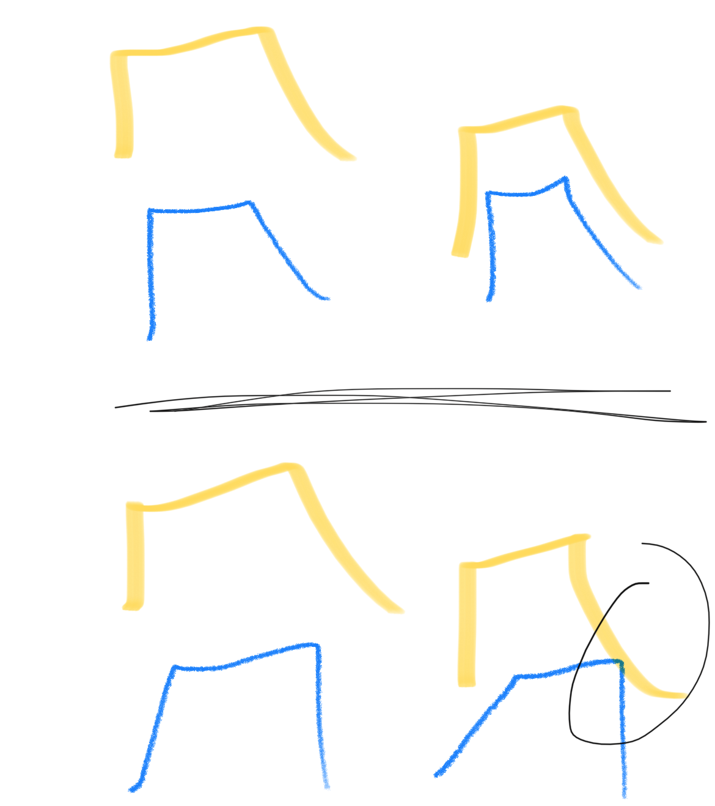
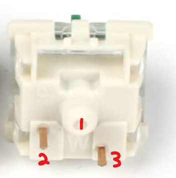
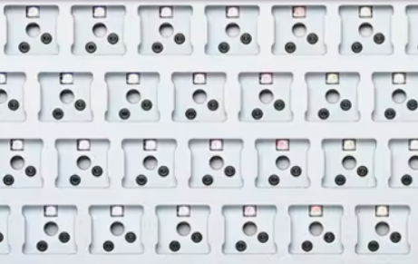

# Will these parts work together?

- [Will these parts work together?](#will-these-parts-work-together)
  - [Keycaps](#keycaps)
    - [Kitting](#kitting)
    - [North facing keycap interference](#north-facing-keycap-interference)
      - [Key switches that mitigate north-facing interference](#key-switches-that-mitigate-north-facing-interference)
  - [Switches](#switches)
    - [When SMD Switches are required](#when-smd-switches-are-required)
    - [3-pin vs 5-pin switches and PCBs](#3-pin-vs-5-pin-switches-and-pcbs)
  - [Stabilizers](#stabilizers)
  - [PCB with case](#pcb-with-case)
  - [Hotswap](#hotswap)

## Keycaps

### Kitting

Please consult [this section](KEYCAPS.md/#on-kitting-or-how-to-read-a-kitting-diagram) on if your
keycaps will work with the board you want to put them on.

### North facing keycap interference

Many cheaper budget boards/prebuilts will have "north facing" switches. To make sense of this statement,
imagine the platform of a switch on the PCB like a compass, where the arrow of the compass faces
towards the LED, or where the LED would be facing.

By Cherry spec, PCBs should should have switches face "south". However, manufacturers will deviate
from this specification and make them face the opposite direction so that light from an LED
will shine through a translucent legend on the keycap and create an impressive effect when
illuminated. These manufacturers work around any possible issues by using a keycap profile that has
greater depth (such as OEM or ASA) than Cherry profile to mitigate any possibility that the keycap
will impact the top housing.

Here is a brief description of the issue: the south end of a Cherry profile cap does not have much
depth, and while on a south facing board it does not matter because the top housing drops off at
a similar angle at that point, on a north facing board, there is more room needed by the top
housing for the bend of the leaf, and that extra occupied space may collide with the keycap when
being pressed down.

Pictured: Diagram provided by milo depicting where a keycap may impact with the top housing
Top: South facing switch bottoming out successfully
Bottom: North facing switch colliding with top housing.

If you are buying **Cherry profile** keycaps, and your PCB has switches that face "north", there is
a non-zero chance that your keycaps will be impacted. These manufacturers are known to make keycaps
thick enough to collide with the top housing of a switch on bottom-out.

Moreover, if you buy cheaper PBT caps, there's a decent chance you'll receive caps that are thin
enough to avoid this interference. Similarly, most other profiles (KAT, MT3, SA, ASA, etc.) will not
impact the top housings of a switch.

| Manufacturer         | Where affected |
| -------------------- | -------------- |
| CRP                  | all rows       |
| ePBT ABS1 | all rows       |
| ePBT PBT             | row 2          |
| GMK                  | row 3          |
| JTK                  | row 2          |

1: ePBT ABS molds are strange, and are also known to collide with the top housings on
boards with south facing switches in some situations.

#### Key switches that mitigate north-facing interference

There are some switches that *may* prevent north facing interference by not bottoming out all the way.

Kailh Box ARTs are the only switch I know that use the advantage of the box leaf placement to mold
the top housing away from where north facing interference would occur.

Otherwise, you may hear suggestions for switches that do not travel a full 4 mm. These include
switches like

- Boba U4Ts/LTs
- Gateron "Box" (Dustproof) Ink
- Akko Radiant Red
- Infinitykey Cow
- Durock POM

These suggestions need to be also taken with a grain of salt, as long pole switches have issues
with stabilizers for the following reason: if a switch cannot bottom out to the full 4mm, then a
stabilizer stem will not be inserted all the way into the keycap. Moreover, the amount of reduced
travel may be insufficient to prevent the keycap-top housing impact.

## Switches

### When SMD Switches are required

Jankier PCBs (read: not many, just the ones that are cheaply produced) that advertise LED lighting
for their switches, instead of cutting a hole for each switch in the PCB and having the LED rest
inside of the hole, they will solder the LED on top of the LED. Therefore, switches that have
bottoms that are flush against the PCB (barring the legs) will collide with the LED, like those in
this screenshot here

| RK68 example - surface mounted                                                                      | Other Example                                          |
| --------------------------------------------------------------------------------------------------- | ------------------------------------------------------ |
|                                                 |   |
| via [Amazon](https://www.amazon.ca/ROYAL-KLUDGE-Switch-Stand-Alone-Multi-Device/dp/B08G4ZB9GL?th=1) | via mechkeys Discord user (apologies to original user) |
| Note that the LED is visibly a bump on the PCB                                                      |

In this unlikely situation (most decent PCBs you find will not be like this), you'll need switches
that are "SMD compatible". The following are generally known to provide the appropriate space in the
bottom housing such LEDs.

- Gateron clear-tops (such as KS9)
- Outemu
- TTC
- Most Kailh stuff
- Some Tecsee switches
  - Not Neapolitans

Switches that are not SMD compatible can be identified by not having the large rectangular cutout
for the LED, but instead having 2-4 thin holes instead for the legs of a throughhole LED.
Switches that would not be SMD compatible may be included (but not limited to)

- JWK/JWICK 4-pin top switches
- Cherry nylon-tops
- SP-Star
- Most Gateron stuff

| SMD compatible switch                                           | Non-SMD compatible switch                      |
| --------------------------------------------------------------- | ---------------------------------------------- |
|                            |  |
| Note the rectangular cutout where a WS2812 diode could fit into | Note a bottom housing that is mostly flush     |

### 3-pin vs 5-pin switches and PCBs

This information should be relatively obvious, but for some, it may not be.

| 3 pin PCB                                    | 5 pin PCB                                               | 3 pin switch                                                                  | 5 pin switch                           |
| -------------------------------------------- | ------------------------------------------------------- | ----------------------------------------------------------------------------- | -------------------------------------- |
|  |  |  |  |
| via [DROP](drop.com)                         |                                                         |                                                                               | via [1up Keyboards](1upkeyboards.com)  |

|              | 3 pin PCB         | 5 pin PCB |
| ------------ | ----------------- | --------- |
| 3 pin switch | Works             | Works     |
| 5 pin switch | Requires clipping | Works     |

## Stabilizers

Use your eyes and brain to see if your case takes plate-mount stabilizers or PCB-mount stabilizers.
Feel free to consult the pictures at [the Stabilizers section](STABILIZERS.md) for a visual guide.

## PCB with case

With a computer build, you just need to know if your case accepts ATX/ITX/mATX motherboards, as well as
the maximum number of slots for your GPU that the case can handle. This is not the case for keyboards;
keyboard PCBs and cases are not interoperable in the same way that computer parts are, with a few
specific exceptions where things have been standardized. Here some of the extremely rare exceptions
where there is some interoperability.

- 60%
  - The GH60 layout is possibly the biggest standardized layout the hobby has - this is not a switch
  layout, this is a tray mount mount-point layout. So generally, any PCB (such as YD60MQ, MJ6*, DZ60*,
  FB60, Instant60, BM60*, XD64) that mentions GH60 compatability will mount properly into a case that
  GH60/DZ60/BM60 layout compatability in (such as, but not limited to) Tofu60, PSD60, etc.
  Likewise, you could throw a DZ60/etc. PCB into a Brutal60 since they have an identical USB port
  location.
  - Ducky One boards and Skyloong GK6*X (GK61X, GK64X) have partial compatability with the tray mount
  points - some of the mount points are shared, some are not. But, they'll mount alright.
  - PCB's like those from the RK61 or Gamakay K61 will not fit. The USB port placement on these boards
  (center and center-right respectively) do not match the GH60 USB port placement between the Esc and
  1 key.
- 65%
  - The MW65 (a taobao board) is known to be compatible with KBD67 MKII PCB's.
  - There are a few 65% PCB's and tray mount cases that appear to be a GH60-compatible PCB extended
  out an extra column. These may look like they would be inter-compatible - they're not! AliExpress
  reviews for the plastic 65% tray mount case that JKDK sells doesn't actually work with the Tofu65
  pcb, only with the JKDK pcb, as the mount points are slightly off.
- 75%
  - The YMD75/YMDK 75/YMDK84 (whichever isn't split) PCB has the same holes for tray mount points that
  the KBD75 PCB has.
- TKL
  - Some more expensive customs/kustoms have a semi-standardized PCB layout with a generally
  standardized bezel width and USB port placement. Some (included, but not limited to) are
  (Hiney) H87C, Fave87C, Infinity87, Infinity87.5, Equalz B87C, Suo87C, Snowpro87C, or for F13 TKLs,
  H88C, Infinity87.5, Jels88.
  - Some PCB and case compatability is documented
  [here](https://docs.google.com/spreadsheets/d/1fZ8FtTGDl222hXnomQJgKmwRnWvg2VuoJ-GeAafVTLc/edit#gid=0)

## Hotswap

Beyond the earlier mentions of how 5 pin switches will not fit in a 3 pin pcb, hotswap sockets are
generally not limited in what switches they would accept, with the exception of Outemu hotswap rivets.
(Note: these look like regular solder joints, and are obviously distinct from the surface mount Outemu
hotswap socket that resembles Kailh/Gateron/TTC/CIY sockets).

Outemu hotswap is limited to Outemu switches (this includes Gazzew Boba switches), as the pins for the
switches are sufficiently thin enough to enter the socket **without sanding**. Other switches that
**may** fit in include

* KTT
  * Akko CS switches are included in this classification
  * May require elbow grease to fit
* Tecsee [?]
  * This is based off of some report that Glorious Holy Pandas fit into a Rakk Ilis without issue.
    Since the manufacturer is generally implied to be Tecsee, other Tecsee switches may fit.
* Huano
  * Kind of hear-say from Reddit.
