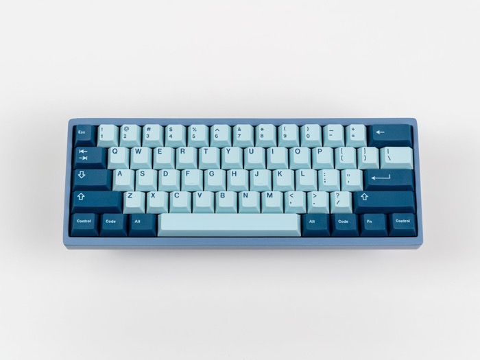
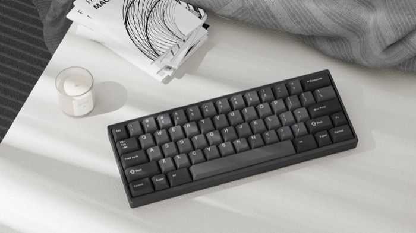
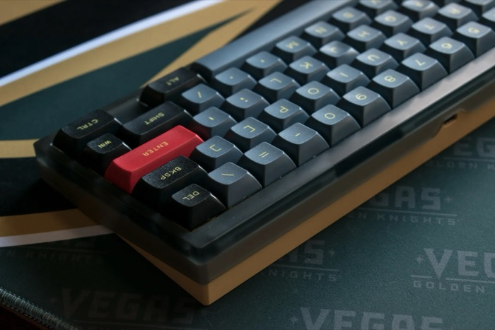
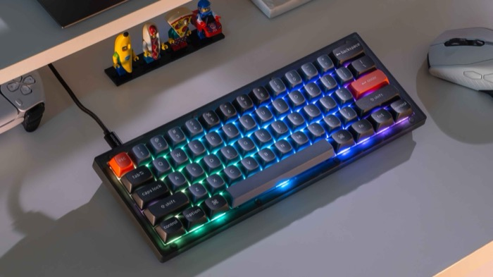
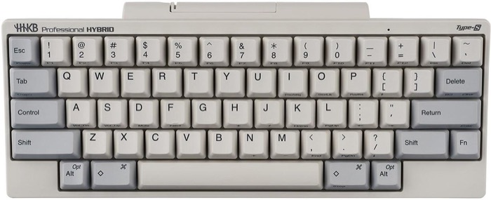
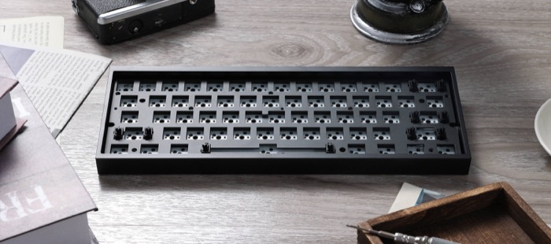

# 60

## Options

|           name          |               image               |                                                                        description                                                                       |                                                                                                                                       links                                                                                                                                       |
|-------------------------|-----------------------------------|----------------------------------------------------------------------------------------------------------------------------------------------------------|-----------------------------------------------------------------------------------------------------------------------------------------------------------------------------------------------------------------------------------------------------------------------------------|
|        Bakeneko60       |    |                                                          Gummy o-ring mounted 60%. The classic.                                                          |                                                                                       [Link](https://cannonkeys.com/products/bakenekogo) [Link](https://cannonkeys.com/products/bakeneko-60)                                                                                      |
|          neo60          |       |                               Rolling release. Grommet gasket pcb-mounted 60%. Maybe some wireless option. Cheap and fancy.                              |                          [Link](https://divinikey.com/products/qwertykeys-neo60-core-keyboard?variant=41997604126785) [Link](https://www.qwertykeys.com/products/neo60) [Link](https://www.qwertykeys.com/products/neo60-cu-custom-mechanical-keyboard-1)                         |
|           QK60          ||                                           Acrylic top, aluminum bottom 60. Plate gasket mount. Cheap and fancy.                                          |                                                                                                              [Link](https://www.qwertykeys.com/products/qk60-round-3)                                                                                                             |
|  Keychron Q4, V4 (Max)  | |         Q4's the metal one, V4's the plastic one. Has your foam, and silicone blubber bottom in the V4. Supports QMK/VIA. Max model is wireless.         |[Link](https://www.keychron.com/products/keychron-v4-qmk-custom-mechanical-keyboard) [Link](https://www.keychron.com/products/keychron-v4-max-qmk-via-wireless-custom-mechanical-keyboard) [Link](https://www.keychron.com/products/keychron-q4-qmk-via-custom-mechanical-keyboard)|
|HHKB Professional Classic|        |The big round bump of Topre isn't something you'll find in MX based switches. Simple and reliable, and allergic to modifications. Some people swear by it.|                                                                                                        [Link](https://mechanicalkeyboards.com/products/hhkb-hybrid-type-s)                                                                                                        |
|       Tofu60 Redux      |  |                                       You bought a Wooting60 and now you want to put the PCB in a fancy metal case.                                      |                                                   [Link](https://divinikey.com/products/kbdfans-tofu60-redux-case) [Link](https://kbdfans.com/products/tofu60-redux-case) [Link](https://kbdfans.com/products/tofu60-redux-kit)                                                   |