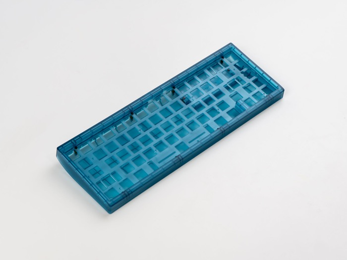
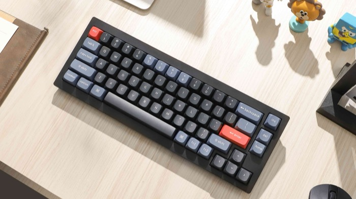
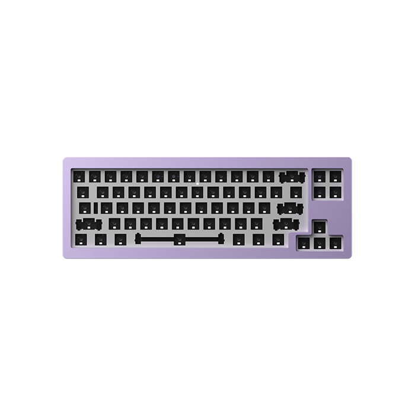
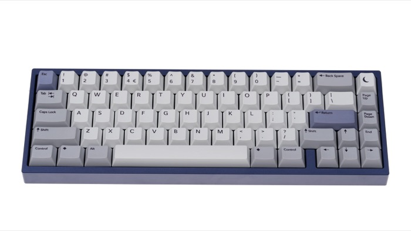
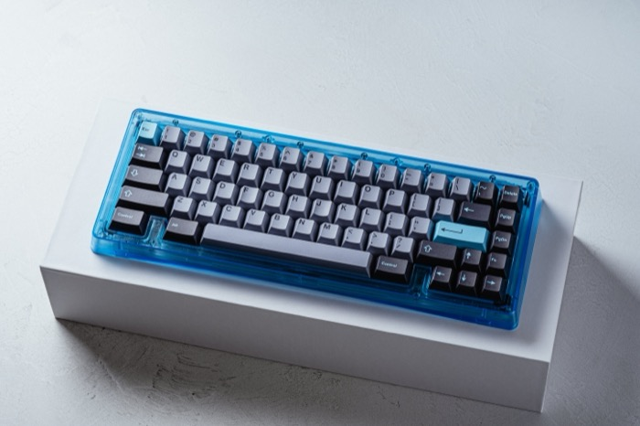
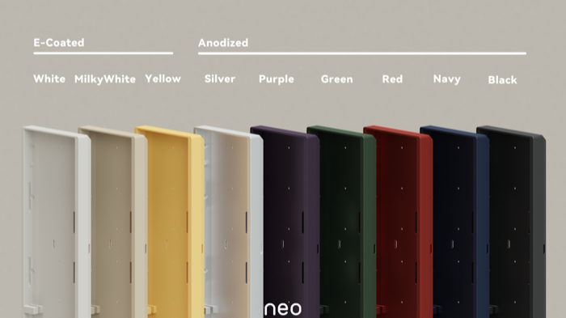
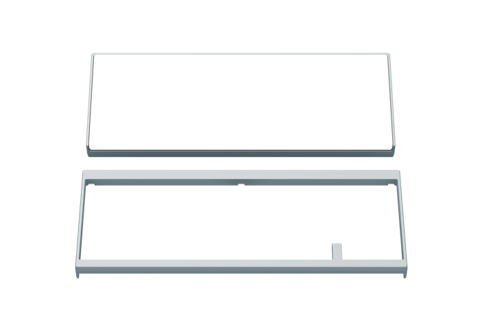
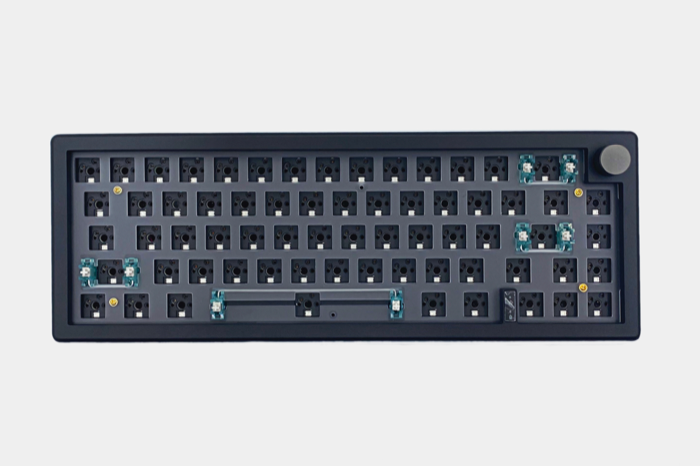
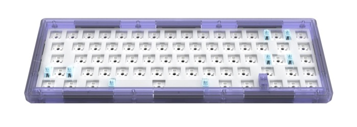

# 65

## Heads up!

If the board you wanted isn't here, it's not because it's bad, maybe we just haven't heard of it!
If a link below is dead, or the board is out of stock at one of the links provided, that doesn't
mean it's impossible to buy! You may just have to search for it on your own! Maybe even on Amazon!
I believe in you!

## Options

|     name     |              image              |                                                                                            description                                                                                           |                                                                                  links                                                                                  |
|--------------|---------------------------------|--------------------------------------------------------------------------------------------------------------------------------------------------------------------------------------------------|-------------------------------------------------------------------------------------------------------------------------------------------------------------------------|
|    Photon    |    |                                          Plastic polycarb 65 that supports wireless through ZMK, so it'll have excellent battery life. Designed by Ai03.                                         |                                                              [Link](https://cannonkeys.com/products/photon)                                                             |
|Keychron Q2/V2|        |It's a Keychron, you know the deal. Q is metal, V is plastic. Exploded arrow key and nav cluster 65 with a knob. Standard, plain, vanilla, but customizable with QMK/VIA and various plate options|[Link](https://www.keychron.com/products/keychron-q2-qmk-custom-mechanical-keyboard) [Link](https://www.keychron.com/products/keychron-v2-qmk-custom-mechanical-keyboard)|
|  Monsgeek M7 |        |                         Metal gasket mounted 65% with the old MF68 layout. Few people complain about Monsgeek quality - you could be one of those people not complaining!                        |                                                          [Link](https://www.monsgeek.com/product-category/65/)                                                          |
|  bakeneko65  ||                             Gummy o-ring mounted 65 with a solid arrow key blocker. Cheaper version is cast and coated aluminum, expensive one is milled and anodized                            |                                [Link](https://cannonkeys.com/products/bakeneko65) [Link](https://cannonkeys.com/products/bakeneko65-cnc)                                |
|  Bauer Lite  ||                                                       Plastic gasket mounted 65 with unique WKL blockers. Solid product for a decent price.                                                      |                                 [Link](https://omnitype.com/products/bauer-lite) [Link](https://oblotzky.industries/products/bauer-lite)                                |
|     neo65    |     |                                                       PCB grommet gasket mounted metal 65. Wireless options. Cheap for the finish you get!                                                       |                   [Link](https://www.qwertykeys.com/products/neo65-1) [Link](https://www.qwertykeys.com/products/neo65-cu-custom-mechanical-keyboard)                   |
|     qk65     |      |                           More complex internally than the neo65, with a few more doodads, but still the same high quality finish for low price. Some wireless options.                          |                              [Link](https://www.qwertykeys.com/products/qk65-v2) [Link](https://www.qwertykeys.com/products/qk65v2-classic)                             |
|     GMK67    |     |                   Plastic wireless gasket mounted China board that sells a bunch, and owners don't seem to complain too much about it. That's enough of a track record for me!                   |                      [Link](https://kineticlabs.com/keyboards/kinetic/gmk67-keyboard) [Link](https://www.aliexpress.us/item/3256805803271779.html)                      |
|     GAS67    |     |                    Same deal as above - a lot of sales and few people complaining about PCBs breaking or batteries lighting on fire. Probably fine if you don't need QMK/VIA.                    |                                                       [Link](https://www.aliexpress.us/item/3256805031744525.html)                                                      |