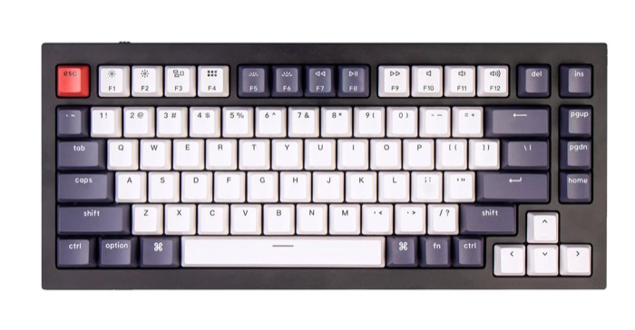
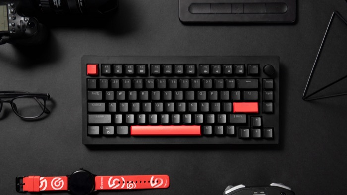
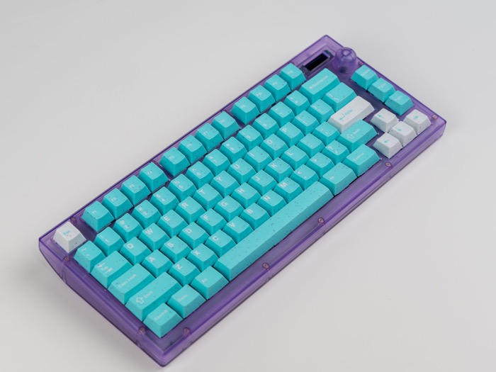
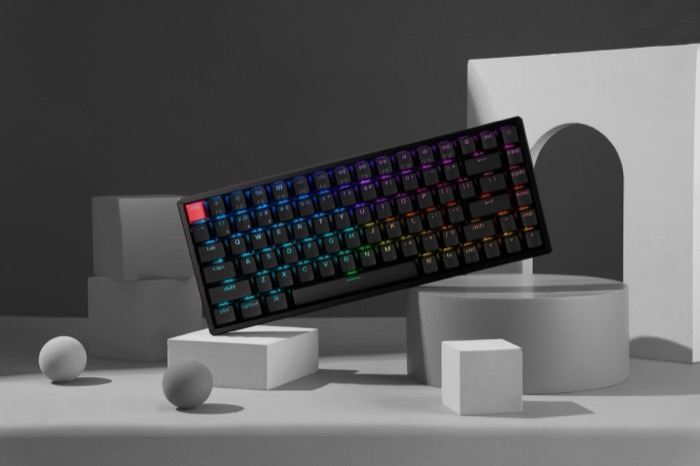

# 75

## Options

|     name     |            image            |                                                                                          description                                                                                         |                                                                          links                                                                         |
|--------------|-----------------------------|----------------------------------------------------------------------------------------------------------------------------------------------------------------------------------------------|--------------------------------------------------------------------------------------------------------------------------------------------------------|
| Realforce RC1|   |                                             Topre in a 75% case. Portable like an HHKB, only with a function row and 2U shift key. Has bluetooth!                                            |                               [Link](https://mechanicalkeyboards.com/products/topre-realforce-rc1-75-bluetooth-keyboard)                               |
|Keychron V1/Q1|    |                 Same deal as the rest, the V series is plastic and the Q series is metal. The Max model is wireless. It's a 75 with foam and a knob! What more could you want                |[Link](https://www.keychron.com/products/keychron-v1-qmk-via-custom-mechanical-keyboard) [Link](https://mechanicalkeyboards.com/products/keychron-q1-v1)|
|  Monsgeek M1 |    |                             Similar to Keychron Q1: a gasket mounted 75 with foam and a knob for a competitive price. M1W is wireless and might not support VIA.                             |                                  [Link](https://www.monsgeek.com/?s=M1) [Link](https://www.amazon.com/s?k=monsgeek+m1)                                 |
|  Lemokey X4  |    |                                             Like a Keychron V1, but cheaper, and without hotswap. Still supports QMK/VIA, still has gamer lights.                                            |                                    [Link](https://www.lemokey.com/products/lemokey-x4-qmk-wired-mechanical-keyboard)                                   |
|    Sat75X    ||                                                        Gasket mounted 75% with a knob and an OLED, only it's not slop like the others.                                                       |                    [Link](https://cannonkeys.com/products/sat75-x?srsltid=AfmBOorGSBswffu4keGTuATsYj0cOZYiQwgZBhq3twu_Q2uPsjhVsP0b)                    |
|  Keychron K2 |    |Older, condensed 75% layout. Supports bluetooth by default, but the Max model supports QMK/VIA. 'Aluminum frame' means there's a strip of aluminum running around the lip of the plastic case.|                            [Link](https://www.keychron.com/products/keychron-k2-qmk-wireless-mechanical-keyboard-version-3)                            |