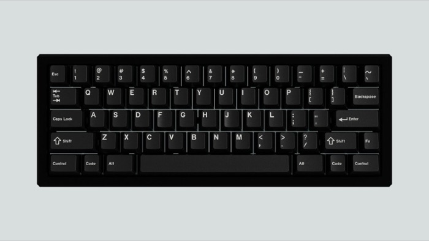
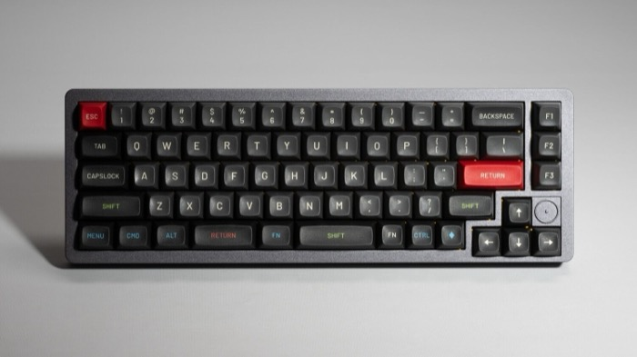
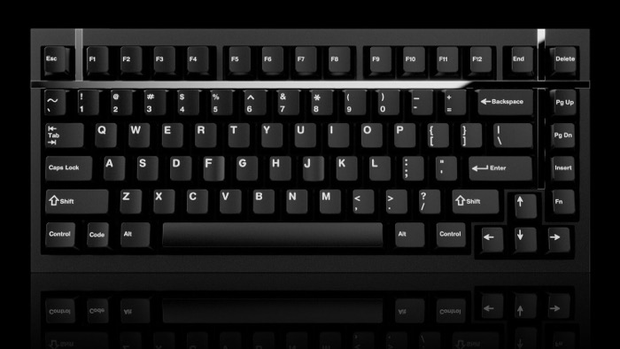
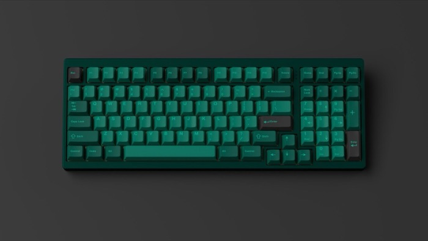

# MechMap

| 40                           | 60                                          |
|------------------------------|---------------------------------------------|
|  |  |
| Big brain on you, huh.       | Number row, and not much else.              |

| 65                              | 75                             |
|---------------------------------|--------------------------------|
|    |    |
| You gotta have your arrow keys. | Arrow keys and a function row. |

| 80/TKL                                      | 96/1800/Full-size                            |
|---------------------------------------------|----------------------------------------------|
|   |                   |
| You do a lot of work, but not with numbers. | You need it all and have no time for layers. |

| Alices and actual Ergo boards              | Macropads                   |
|--------------------------------------------|-----------------------------|
|  |  |
| You're different.                          | You need more.              |