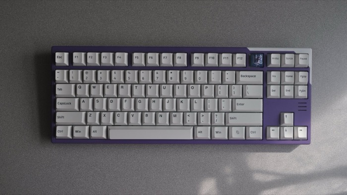

# MechMap

| [40](40.md)                             | [60](60.md)                                |
|-----------------------------------------|--------------------------------------------|
|  |  |
| Big brain on you, huh.                  | Number row, and not much else.             |

| 65 (not done yet)               | [75](75.md)  (not done yet)             |
|---------------------------------|-----------------------------------------|
|    |  |
| You gotta have your arrow keys. | Arrow keys and a function row.          |

| [TKL](tkl.md)                               | 96/1800/Full-size     (not done yet)         |
|---------------------------------------------|----------------------------------------------|
|     |                   |
| You do a lot of work, but not with numbers. | You need it all and have no time for layers. |

<!-- | Alices and actual Ergo boards  | Macropads                   |
-----|--------------------------------|-----------------------------|----
     |  |  |
     | You're different.              | You need more.              | -->