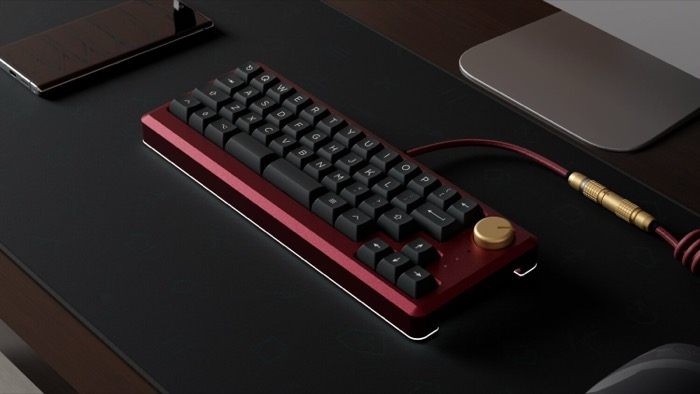

# MechMap

| [40](40.md)                  | [60](60.md)                                 |
|------------------------------|---------------------------------------------|
|  |  |
| Big brain on you, huh.       | Number row, and not much else.              |

| 65                              | [75](75.md)                    |
|---------------------------------|--------------------------------|
|    |    |
| You gotta have your arrow keys. | Arrow keys and a function row. |

| [TKL](tkl.md)                               | 96/1800/Full-size                            |
|---------------------------------------------|----------------------------------------------|
|                |                   |
| You do a lot of work, but not with numbers. | You need it all and have no time for layers. |

| Alices and actual Ergo boards | Macropads                   |
|-------------------------------|-----------------------------|
|  |  |
| You're different.             | You need more.              |